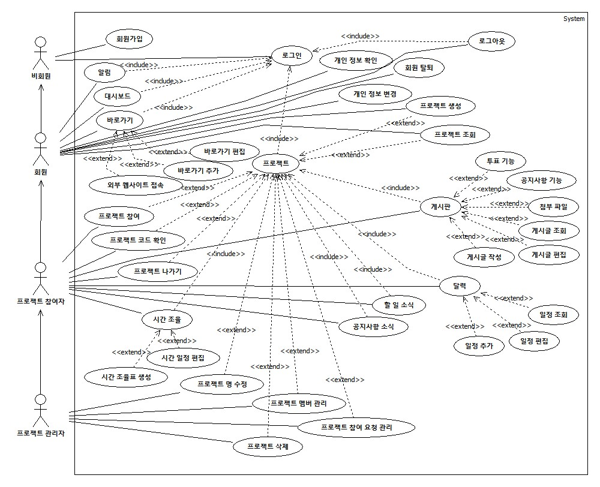

## 2. Use case analysis
### 2.1 Use Case Diagram

[그림 1-1] Use Case Diagram

### 2.2 Use Case Description

### Use case #1 회원가입

#### GENERAL CHARACTERISTICS
| | |
| :--- | :--- |
| **Summary** | 웹사이트의 서비스를 사용하기 위한 절차이며, 모든 사용자는 사용에 앞서 회원가입을 해야 한다. |
| **Scope** | 협업의 민족 |
| **Level** | User level |
| **Author** | 박한비 |
| **Last Update** | 2025. 10. 28. |
| **Status** | Analysis |
| **Primary Actor** | 비회원 |
| **Preconditions** | 웹사이트에 접속한 상태여야 한다. |
| **Trigger** | 로그인 페이지에서 회원가입 버튼을 누를 때 |
| **Success Post Condition** | 사용자의 계정이 생성되고, 로그인을 진행할 수 있다. |
| **Failed Post Condition** | 사용자는 회원가입에 실패한다. |

#### MAIN SUCCESS SCENARIO
| Step | Action |
| :--- | :--- |
| S | 사용자가 ‘협업의 민족’을 사용하기 위해 회원가입을 한다. |
| 1 | 사용자는 로그인 페이지에서 회원가입 버튼을 누른다. |
| 2 | 시스템은 회원가입에 필요한 정보를 작성할 양식(이름, 이메일, 비밀번호, 전화번호, 전공/직무)을 보여준다. |
| 3 | 사용자는 아이디(이메일)를 입력하고, 중복 확인을 한다. |
| 4 | 나머지 정보들을 입력하고 회원가입 버튼을 누른다. |
| 5 | 시스템은 회원가입이 성공한지 판단한다. |
| 6 | 회원가입이 완료되면 끝난다. |

#### EXTENSION SCENARIOS
| Step | Branching Action |
| :--- | :--- |
| 3 | 3a. 아이디(이메일)가 다른 사용자와 중복된 경우 |
| | 3a.1. 아이디 중복 메시지를 출력한다. |
| | 3a.2. 아이디를 입력하는 단계로 돌아간다. (Use case #1-3) |
| 5 | 5a. 입력정보가 양식과 다르거나 필수 항목에 아무것도 입력되지 않은 경우 |
| | 5a.1. 오류가 발생한 정보의 칸 아래에 시스템은 오류 메시지를 출력한다. |
| | 5a.2. 사용자 정보를 입력하는 단계로 돌아간다. (Use case #1-4) |

#### RELATED INFORMATION
| | |
| :--- | :--- |
| **Performance** | ≦ 3 Seconds |
| **Frequency** | 제한 없음 |
| **Concurrency** | 제한 없음 |
| **Due Date** | |

### Use case #2 로그인

#### GENERAL CHARACTERISTICS
| | |
| :--- | :--- |
| **Summary** | 웹사이트의 서비스를 사용하기 위해 로그인이 필요하다. |
| **Scope** | 협업의 민족 |
| **Level** | User level |
| **Author** | 박한비 |
| **Last Update** | 2025. 10. 28. |
| **Status** | Analysis |
| **Primary Actor** | 비회원 |
| **Preconditions** | 웹사이트에 접속한 상태여야 한다. |
| **Trigger** | 로그인 페이지에서 로그인 버튼을 누를 때 |
| **Success Post Condition** | 사용자는 로그인에 성공하여 메인 페이지로 이동된다. |
| **Failed Post Condition** | 사용자는 로그인에 실패한다. |

#### MAIN SUCCESS SCENARIO
| Step | Action |
| :--- | :--- |
| S | 사용자가 ‘협업의 민족’을 사용하기 위해 로그인을 한다. |
| 1 | 사용자는 ID(이메일)와 비밀번호를 입력하고 로그인 버튼을 누른다. |
| 2 | 시스템은 로그인이 성공한지 판단한다. |
| 3 | 로그인에 성공하면 끝난다. |

#### EXTENSION SCENARIOS
| Step | Branching Action |
| :--- | :--- |
| 2 | 2a. 비밀번호가 일치하지 않는 경우 |
| | 2a.1. 비밀번호 칸 아래에 시스템은 오류 메시지를 출력한다. |
| | 2a.2. 비밀번호를 입력하는 단계로 돌아간다. (Use case #2-1) |
| | 2b. 사용자 정보가 존재하지 않는 경우(아이디가 일치하지 않는 경우) |
| | 2b.1. 아이디 칸 아래에 시스템은 오류 메시지를 출력한다. |

#### RELATED INFORMATION
| | |
| :--- | :--- |
| **Performance** | ≦ 3 Seconds |
| **Frequency** | 제한 없음 |
| **Concurrency** | 제한 없음 |
| **Due Date** | |

### Use case #3 대시보드

#### GENERAL CHARACTERISTICS
| | |
| :--- | :--- |
| **Summary** | 프로젝트의 달력에서 추가한 일정 중 참가자로 있는 한 달 이내의 일정을 확인한다. |
| **Scope** | 협업의 민족 |
| **Level** | User level |
| **Author** | 박한비 |
| **Last Update** | 2025. 10. 28. |
| **Status** | Analysis |
| **Primary Actor** | 회원 |
| **Preconditions** | 사용자는 로그인 된 상태여야 한다. |
| **Trigger** | 메인 페이지에 접근할 때 |
| **Success Post Condition** | 모든 프로젝트에서 참가자로 설정된 일정을 확인한다. |
| **Failed Post Condition** | 시스템이 일정 불러오기에 실패한다. |

#### MAIN SUCCESS SCENARIO
| Step | Action |
| :--- | :--- |
| S | 모든 프로젝트에서 참가자로 설정된 일정을 확인한다. |
| 1 | 사용자는 메인 페이지에 접근한다. |
| 2 | 시스템은 DB에서 모든 프로젝트 달력에서 사용자가 참가자로 등록된 일정 중 오늘을 기준으로 한 달 이내에 마감되는 일정의 정보를 불러온다. |
| 3 | 시스템은 불러온 정보를 마감 날짜별로 프로젝트 이름과 일정 이름으로 화면에 표시한다. |
| 4 | 사용자가 정보를 확인하면 끝난다. |

#### EXTENSION SCENARIOS
| Step | Branching Action |
| :--- | :--- |
| 3 | 3a. 시스템이 불러온 정보가 없을 경우 |
| | 3a.1. 정보가 없는 경우 빈 화면으로 표시한다. |

#### RELATED INFORMATION
| | |
| :--- | :--- |
| **Performance** | ≦ 3 Seconds |
| **Frequency** | 사용자가 페이지에 접근할 때 마다 |
| **Concurrency** | 제한 없음 |
| **Due Date** | |

### Use case #4 알림

#### GENERAL CHARACTERISTICS
| | |
| :--- | :--- |
| **Summary** | 프로젝트의 게시판 공지사항이나 투표 마감을 알려주는 알림을 확인한다. |
| **Scope** | 협업의 민족 |
| **Level** | User level |
| **Author** | 박한비 |
| **Last Update** | 2025. 10. 28. |
| **Status** | Analysis |
| **Primary Actor** | 회원 |
| **Preconditions** | 사용자는 로그인 된 상태여야 한다. |
| **Trigger** | 메인 페이지에 접근할 때 |
| **Success Post Condition** | 참여중인 모든 프로젝트의 알림을 확인한다. |
| **Failed Post Condition** | 시스템이 알림의 사용될 정보를 불러오기에 실패한다. |

#### MAIN SUCCESS SCENARIO
| Step | Action |
| :--- | :--- |
| S | 참여중인 모든 프로젝트의 알림을 확인한다. |
| 1 | 사용자는 메인 페이지에 접근한다. |
| 2 | 시스템은 DB에서 모든 프로젝트에서 새로 등록된 공지사항이나 마감 1일 전인 투표 정보를 불러온다. |
| 3 | 시스템은 불러온 정보를 프로젝트 명을 포함하여 새로운 공지사항 등록 또는 마감 1일 전 투표 이름을 알림 도착 시간과 함께 표시한다. |
| 4 | 사용자가 정보를 확인하면 끝난다. |

#### EXTENSION SCENARIOS
| Step | Branching Action |
| :--- | :--- |
| 3 | 3a. 시스템이 불러온 정보가 없을 경우 |
| | 3a.1. 정보가 없는 경우 빈 화면으로 표시한다. |
| | 3b. 도착한 알림 |
| | 3b.1. 알림은 따로 삭제되지 않는다. |
| | 3b.2. 스크롤을 통해 이전 알림 내역을 확인할 수 있다. |

#### RELATED INFORMATION
| | |
| :--- | :--- |
| **Performance** | ≦ 3 Seconds |
| **Frequency** | 사용자가 페이지에 접근할 때 마다 |
| **Concurrency** | 제한 없음 |
| **Due Date** | |

### Use case #5 바로가기 추가

#### GENERAL CHARACTERISTICS
| | |
| :--- | :--- |
| **Summary** | 외부 웹사이트의 주소를 등록하여 바로가기로 추가한다. |
| **Scope** | 협업의 민족 |
| **Level** | User level |
| **Author** | 박한비 |
| **Last Update** | 2025. 10. 29. |
| **Status** | Analysis |
| **Primary Actor** | 회원 |
| **Preconditions** | 사용자는 로그인 된 상태여야 한다. |
| **Trigger** | 메인 페이지에 접속 중일 때 |
| **Success Post Condition** | 사용자가 원하는 외부 웹사이트를 바로가기에 추가한다. |
| **Failed Post Condition** | 외부 웹사이트 추가에 실패한다. |

#### MAIN SUCCESS SCENARIO
| Step | Action |
| :--- | :--- |
| S | 자주 사용하는 외부 웹사이트 주소를 등록하여 바로가기를 추가한다. |
| 1 | 사용자는 메인 페이지에 접속한다. |
| 2 | 바로가기의 추가 버튼을 누른다. |
| 3 | 등록하고자 하는 웹사이트의 주소와 이름 작성하여 추가한다. |
| 4 | 시스템은 등록된 바로가기를 목록을 화면에 표시한다. |
| 5 | 바로가기가 추가되면 끝난다. |

#### EXTENSION SCENARIOS
| Step | Branching Action |
| :--- | :--- |
| 3 | 3a. 이미 추가된 바로가기가 10개인 경우 |
| | 3a.1. 더 이상 바로가기를 추가할 수 없어 시스템은 오류 메시지를 출력한다. |
| 4 | 4a. 시스템이 불러온 정보가 없을 경우 |
| | 4a.1. 정보가 없는 경우 빈 화면으로 표시한다. |

#### RELATED INFORMATION
| | |
| :--- | :--- |
| **Performance** | ≦ 3 Seconds |
| **Frequency** | 사용자가 기능을 실행할 때 마다 |
| **Concurrency** | 제한 없음 |
| **Due Date** | |

### Use case #6 바로가기 편집

#### GENERAL CHARACTERISTICS
| | |
| :--- | :--- |
| **Summary** | 등록한 웹사이트의 주소나 이름을 수정하거나, 추가한 바로가기 자체를 삭제한다. |
| **Scope** | 협업의 민족 |
| **Level** | User level |
| **Author** | 박한비 |
| **Last Update** | 2025. 10. 29. |
| **Status** | Analysis |
| **Primary Actor** | 회원 |
| **Preconditions** | 추가된 바로가기가 최소 1개는 존재해야 한다. |
| **Trigger** | 추가된 바로가기의 ··· 버튼을 누를 때 |
| **Success Post Condition** | 등록한 바로가기의 수정 또는 삭제에 성공한다. |
| **Failed Post Condition** | 등록한 바로가기의 수정 또는 삭제에 실패한다. |

#### MAIN SUCCESS SCENARIO
| Step | Action |
| :--- | :--- |
| S | 이미 추가된 바로가기의 내용을 수정 또는 삭제한다. |
| 1 | 사용자는 추가된 바로가기의 ··· 버튼을 눌러 수정 또는 삭제를 선택한다. |
| 2 | 바로가기의 내용을 수정하여 다시 저장하거나 삭제한다. |
| 3 | 동작을 수행한 결과를 시스템은 해당 바로가기에 적용하여 바로가기 목록을 표시한다. |
| 4 | 성공적으로 동작이 수행된 결과를 사용자가 확인하면 끝난다. |

#### EXTENSION SCENARIOS
| Step | Branching Action |
| :--- | :--- |
| 1 | 1a. 수정을 선택한 경우 |
| | 1a.1. 바로가기 수정 단계로 이동한다. (Use case #6-2a) |
| | 1b. 삭제를 선택한 경우 |
| | 1b.1. 바로가기 삭제 단계로 이동한다. (Use case #6-2b) |
| 2 | 2a. 바로가기를 수정하는 경우 |
| | 2a.1. 등록한 주소나 이름을 수정하고자 하는 것으로 변경하여 저장한다. |
| | 2a.2. 시스템은 DB에 정보를 업데이트한다. |
| | 2b. 바로가기를 삭제하는 경우 |
| | 2b.1. 추가된 바로가기가 삭제된다. |
| | 2b.2. 시스템은 DB에서 정보를 삭제한다. |

#### RELATED INFORMATION
| | |
| :--- | :--- |
| **Performance** | ≦ 3 Seconds |
| **Frequency** | 사용자가 기능을 실행할 때 마다 |
| **Concurrency** | 제한 없음 |
| **Due Date** | |

### Use case #7 외부 웹사이트 접속

#### GENERAL CHARACTERISTICS
| | |
| :--- | :--- |
| **Summary** | 추가한 바로가기를 사용하여 외부 웹사이트에 접속한다. |
| **Scope** | 협업의 민족 |
| **Level** | User level |
| **Author** | 박한비 |
| **Last Update** | 2025. 10. 29. |
| **Status** | Analysis |
| **Primary Actor** | 회원 |
| **Preconditions** | 추가된 바로가기가 최소 1개는 존재해야 한다. |
| **Trigger** | 추가된 바로가기 버튼을 누를 때 |
| **Success Post Condition** | 사용자가 원하는 외부 웹사이트로 접근한다. |
| **Failed Post Condition** | 외부 웹사이트로 접근하지 못한다. |

#### MAIN SUCCESS SCENARIO
| Step | Action |
| :--- | :--- |
| S | 바로가기를 선택하여 외부 웹사이트에 접근한다. |
| 1 | 사용자는 등록된 바로가기 중 이동하고자 하는 바로가기를 선택한다. |
| 2 | 시스템은 새로운 창을 열어 사용자가 선택한 웹사이트로 이동시킨다. |
| 3 | 사용자가 새 창에서 웹사이트 접속을 확인하면 끝난다. |

#### EXTENSION SCENARIOS
*내용 없음*

#### RELATED INFORMATION
| | |
| :--- | :--- |
| **Performance** | ≦ 3 Seconds |
| **Frequency** | 사용자가 기능을 실행할 때 마다 |
| **Concurrency** | 제한 없음 |
| **Due Date** | |

### Use case #8 개인정보 변경

#### GENERAL CHARACTERISTICS
| | |
| :--- | :--- |
| **Summary** | 회원가입 시 등록한 이름, 비밀번호, 전화번호, 전공/직무를 변경한다. |
| **Scope** | 협업의 민족 |
| **Level** | User level |
| **Author** | 박한비 |
| **Last Update** | 2025. 10. 29. |
| **Status** | Analysis |
| **Primary Actor** | 회원 |
| **Preconditions** | 사용자는 설정 페이지에 접근하여 회원 정보를 볼 수 있는 상태여야 한다. |
| **Trigger** | 변경하고자 하는 정보의 수정 아이콘을 누를 때 |
| **Success Post Condition** | 사용자의 개인정보가 수정된다. |
| **Failed Post Condition** | 사용자의 개인정보 수정에 실패한다. |

#### MAIN SUCCESS SCENARIO
| Step | Action |
| :--- | :--- |
| S | 회원가입 시 등록한 개인정보를 변경한다. |
| 1 | 사용자는 변경하고자 하는 정보의 수정 아이콘을 누른다. |
| 2 | 변경하고자 하는 정보를 수정한다. |
| 3 | 동작을 수행한 결과를 시스템은 DB에 저장한다. |
| 4 | 사용자의 개인정보가 변경되면 끝난다. |

#### EXTENSION SCENARIOS
| Step | Branching Action |
| :--- | :--- |
| 1 | 1a. 이름 수정 아이콘을 선택한 경우 |
| | 1a.1. 이름 변경 단계로 이동한다. (Use case #8-2a) |
| | 1b. 비밀번호 수정 아이콘을 선택한 경우 |
| | 1b.1. 비밀번호 변경 단계로 이동한다. (Use case #8-2b) |
| | 1c. 전화번호 수정 아이콘을 선택한 경우 |
| | 1c.1. 전화번호 변경 단계로 이동한다. (Use case #8-2c) |
| | 1d. 전공/직무 수정 아이콘을 선택한 경우 |
| | 1d.1. 전공/직무 변경 단계로 이동한다. (Use case #8-2d) |
| 2 | 2a. 사용자의 이름을 변경하는 하는 경우 |
| | 2a.1. 변경하고자 하는 이름을 작성하여 변경한다. |
| | 2b. 사용자의 비밀번호를 변경하는 하는 경우 |
| | 2b.1. 현재 설정된 비밀번호를 입력한다. |
| | 2b.1.ⅰ. 저장된 사용자의 비밀번호와 일치하지 않는 경우 |
| | 2b.1.ⅰ.. 시스템은 오류 메시지를 출력한다. |
| | 2b.1.ⅰ.. 비밀번호를 입력하는 단계로 돌아간다. (Use case #8-2b.1) |
| | 2b.2. 새로 설정할 비밀번호를 조건에 맞게 입력한다. |
| | 2b.2.ⅰ. 입력정보가 양식과 다른 경우 |
| | 2b.2.ⅰ.. 시스템은 오류 메시지를 출력한다. |
| | 2b.2.ⅰ.. 비밀번호를 입력하는 단계로 돌아간다. (Use case #8-2b.2) |
| | 2b.3. 새로 설정할 비밀번호 확인을 위해 다시 입력한다. |
| | 2b.3.ⅰ. 비밀번호가 일치하지 않는 경우 |
| | 2b.3.ⅰ.. 시스템은 오류 메시지를 출력한다. |
| | 2b.3.ⅰ.. 비밀번호를 입력하는 단계로 돌아간다. (Use case #8-2b.3) |
| | 2c. 사용자의 전화번호를 변경하는 하는 경우 |
| | 2c.1. 변경하고자 하는 전화번호를 작성하여 변경한다. |
| | 2d. 전공/직무를 변경하는 하는 경우 |
| | 2d.1. 카테고리에서 변경하고자 하는 전공/직무를 선택하여 변경한다. |

#### RELATED INFORMATION
| | |
| :--- | :--- |
| **Performance** | ≦ 3 Seconds |
| **Frequency** | 사용자가 기능을 실행할 때 마다 |
| **Concurrency** | 제한 없음 |
| **Due Date** | |

### Use case #9 회원 탈퇴

#### GENERAL CHARACTERISTICS
| | |
| :--- | :--- |
| **Summary** | 웹사이트 사용을 더 이상 사용하지 않을 사용자들은 회원을 탈퇴한다. |
| **Scope** | 협업의 민족 |
| **Level** | User level |
| **Author** | 박한비 |
| **Last Update** | 2025. 10. 29. |
| **Status** | Analysis |
| **Primary Actor** | 회원 |
| **Preconditions** | 사용자는 설정 페이지에 접근하여 회원 정보를 볼 수 있는 상태여야 한다. |
| **Trigger** | 사용자가 회원 탈퇴 버튼을 누를 때 |
| **Success Post Condition** | 사용자의 계정 정보가 ‘협업의 민족’에서 삭제된다. |
| **Failed Post Condition** | 사용자는 회원 탈퇴에 실패한다. |

#### MAIN SUCCESS SCENARIO
| Step | Action |
| :--- | :--- |
| S | 사용자는 ‘협업의 민족’ 웹사이트에서 탈퇴한다. |
| 1 | 회원 탈퇴 버튼을 누른다. |
| 2 | 사용자는 현재 설정된 비밀번호를 입력한다. |
| 3 | 비밀번호가 일치하면 사용자는 시스템에 회원 탈퇴를 요청한다. |
| 4 | 시스템은 DB에서 해당 사용자의 개인 정보만 삭제한다. |
| 5 | 사용자의 정보가 DB에서 삭제되면 끝난다. |

#### EXTENSION SCENARIOS
| Step | Branching Action |
| :--- | :--- |
| 3 | 3a. 비밀번호가 일치하지 않을 경우 |
| | 3a.1. 시스템은 오류 메시지를 출력한다. |
| | 3a.2. 비밀번호를 입력하는 단계로 돌아간다. (Use case #9-2) |

#### RELATED INFORMATION
| | |
| :--- | :--- |
| **Performance** | ≦ 3 Seconds |
| **Frequency** | 사용자 당 1번 |
| **Concurrency** | 제한 없음 |
| **Due Date** | |

### Use case #10 프로젝트 생성

#### GENERAL CHARACTERISTICS
| | |
| :--- | :--- |
| **Summary** | 다른 사용자와 공유하기 위한 새로운 프로젝트를 생성한다. |
| **Scope** | 협업의 민족 |
| **Level** | User level |
| **Author** | 박한비 |
| **Last Update** | 2025. 10. 29. |
| **Status** | Analysis |
| **Primary Actor** | 회원 |
| **Preconditions** | 사용자는 로그인 된 상태여야 한다. |
| **Trigger** | 프로젝트 생성 버튼을 누를 때 |
| **Success Post Condition** | 새로운 프로젝트 생성에 성공하여 목록에 추가된다. |
| **Failed Post Condition** | 새로운 프로젝트 생성에 실패한다. |

#### MAIN SUCCESS SCENARIO
| Step | Action |
| :--- | :--- |
| S | 협업을 위한 새로운 프로젝트를 생성한다. |
| 1 | 프로젝트 생성하기 버튼을 누른다. |
| 2 | 시스템은 프로젝트를 생성하고 참여 코드를 부여한다. |
| 3 | 시스템은 프로젝트를 생성한 사용자에게 관리자 권한을 부여한다. |
| 4 | 시스템은 사용자를 프로젝트 관리 페이지로 이동시킨다. |
| 5 | 프로젝트가 생성되어 목록에 추가되면 끝난다. |

#### EXTENSION SCENARIOS
| Step | Branching Action |
| :--- | :--- |
| 2 | 2a. 프로젝트 명 |
| | 2a.1. 프로젝트는 '빈 프로젝트' 이름으로 생성된다. |
| | 2a.2. 프로젝트 명은 관리 페이지로 이동되면 수정할 수 있다. |
| | 2b. 참여 코드 |
| | 2b.1. 참여 코드는 영어와 숫자가 랜덤으로 섞인 6자리이다. |
| | 2b.2. 관리 페이지로 이동되면 참여 코드를 확인할 수 있다. |

#### RELATED INFORMATION
| | |
| :--- | :--- |
| **Performance** | ≦ 3 Seconds |
| **Frequency** | 사용자가 기능을 실행할 때 마다 |
| **Concurrency** | 제한 없음 |
| **Due Date** | |

### Use case #11 프로젝트 조회

#### GENERAL CHARACTERISTICS
| | |
| :--- | :--- |
| **Summary** | 확인하고자 하는 프로젝트를 조회한다. |
| **Scope** | 협업의 민족 |
| **Level** | User level |
| **Author** | 박한비 |
| **Last Update** | 2025. 10. 29. |
| **Status** | Analysis |
| **Primary Actor** | 회원 |
| **Preconditions** | 사용자가 참여 중인 프로젝트가 최소 1개는 존재해야 한다. |
| **Trigger** | 프로젝트 목록에서 프로젝트 이름을 누를 때 |
| **Success Post Condition** | 선택한 프로젝트의 페이지로 이동된다. |
| **Failed Post Condition** | 선택한 프로젝트의 페이지로 이동 실패한다. |

#### MAIN SUCCESS SCENARIO
| Step | Action |
| :--- | :--- |
| S | 확인하고자 하는 프로젝트를 조회한다. |
| 1 | 프로젝트 목록에서 확인하고자 하는 프로젝트의 이름을 누른다. |
| 2 | 사용자는 선택한 프로젝트의 페이지로 이동된다. |
| 3 | 사용자가 선택한 프로젝트의 페이지로 이동되면 끝난다. |

#### EXTENSION SCENARIOS
*내용 없음*

#### RELATED INFORMATION
| | |
| :--- | :--- |
| **Performance** | ≦ 3 Seconds |
| **Frequency** | 사용자가 기능을 실행할 때 마다 |
| **Concurrency** | 제한 없음 |
| **Due Date** | |

### Use case #12 프로젝트 명 수정

#### GENERAL CHARACTERISTICS
| | |
| :--- | :--- |
| **Summary** | 프로젝트의 명을 수정한다. |
| **Scope** | 협업의 민족 |
| **Level** | User level |
| **Author** | 박한비 |
| **Last Update** | 2025. 10. 29. |
| **Status** | Analysis |
| **Primary Actor** | 관리자 |
| **Preconditions** | 사용자는 해당 프로젝트의 관리자 권한을 가지고, 프로젝트 관리 페이지에 접근한 상태여야 한다. |
| **Trigger** | 프로젝트 명 수정 버튼을 누를 때 |
| **Success Post Condition** | 프로젝트 명이 수정된다. |
| **Failed Post Condition** | 프로젝트 명 수정에 실패한다. |

#### MAIN SUCCESS SCENARIO
| Step | Action |
| :--- | :--- |
| S | 프로젝트의 명을 수정한다. |
| 1 | 프로젝트 명 옆의 수정 버튼을 누른다. |
| 2 | 새로운 프로젝트 명으로 수정한다. |
| 3 | 시스템은 DB에 변경된 프로젝트 명을 저장하고, 모든 참여자의 프로젝트 목록에 즉시 반영한다. |
| 4 | 사용자가 변경된 프로젝트 명을 확인하면 끝난다. |

#### EXTENSION SCENARIOS
*내용 없음*

#### RELATED INFORMATION
| | |
| :--- | :--- |
| **Performance** | ≦ 3 Seconds |
| **Frequency** | 사용자가 기능을 실행할 때 마다 |
| **Concurrency** | 제한 없음 |
| **Due Date** | |

### Use case #13 프로젝트 참여 요청 관리

#### GENERAL CHARACTERISTICS
| | |
| :--- | :--- |
| **Summary** | 참여자들의 프로젝트 참여 요청을 관리자가 승인 또는 거절한다. |
| **Scope** | 협업의 민족 |
| **Level** | User level |
| **Author** | 박한비 |
| **Last Update** | 2025. 10. 29. |
| **Status** | Analysis |
| **Primary Actor** | 관리자 |
| **Preconditions** | 사용자는 해당 프로젝트의 관리자 권한을 가지고, 프로젝트 관리 페이지에 접근한 상태여야 하며, 참여 요청을 보낸 사용자가 최소 1명은 존재해야 한다. |
| **Trigger** | 멤버 승인 또는 거절 아이콘을 누를 때 |
| **Success Post Condition** | 참여 요청의 승인 또는 거절이 성공한다. |
| **Failed Post Condition** | 참여 요청의 승인 또는 거절이 실패한다. |

#### MAIN SUCCESS SCENARIO
| Step | Action |
| :--- | :--- |
| S | 참여 요청을 관리자 권한으로 승인 또는 거절한다. |
| 1 | 승인 대기 멤버 칸에서 승인 또는 거절 아이콘을 선택한다. |
| 2 | 선택한 동작에 따라 시스템은 화면을 업데이트하여 표시한다. |
| 3 | 참여 요청을 승인 또는 거절 완료하면 끝난다. |

#### EXTENSION SCENARIOS
| Step | Branching Action |
| :--- | :--- |
| 2 | 2a. 승인 아이콘을 선택한 경우 |
| | 2a.1. 승인 대기 멤버 칸에서 해당 멤버가 사라진다. |
| | 2a.2. 프로젝트 멤버 칸에 승인된 멤버가 추가된다. |
| | 2b. 거절 아이콘을 선택한 경우 |
| | 2b.1. 승인 대기 멤버 칸에서 해당 멤버가 사라진다. |

#### RELATED INFORMATION
| | |
| :--- | :--- |
| **Performance** | ≦ 3 Seconds |
| **Frequency** | 사용자가 기능을 실행할 때 마다 |
| **Concurrency** | 제한 없음 |
| **Due Date** | |

### Use case #14 프로젝트 멤버 관리

#### GENERAL CHARACTERISTICS
| | |
| :--- | :--- |
| **Summary** | 프로젝트에 참여 중인 사용자들에 대해 멤버 삭제나 관리자 권한을 양도한다. |
| **Scope** | 협업의 민족 |
| **Level** | User level |
| **Author** | 박한비 |
| **Last Update** | 2025. 10. 29. |
| **Status** | Analysis |
| **Primary Actor** | 관리자 |
| **Preconditions** | 사용자는 해당 프로젝트의 관리자 권한을 가지고, 프로젝트 관리 페이지에 접근한 상태여야 하며, 참여 중인 사용자가 관리자를 제외하고 최소 1명은 존재해야 한다. |
| **Trigger** | 멤버 삭제 또는 관리자 권한 넘기기 아이콘을 누를 때 |
| **Success Post Condition** | 해당 프로젝트의 멤버를 삭제하거나 관리자 권한을 넘겨준다. |
| **Failed Post Condition** | 멤버 삭제나 관리자 권한 양도에 실패한다. |

#### MAIN SUCCESS SCENARIO
| Step | Action |
| :--- | :--- |
| S | 프로젝트에 참여 중인 사용자들을 삭제하거나 관리자 권한을 양도한다. |
| 1 | 프로젝트 멤버 칸에서 삭제 또는 관리자 권한 넘기기 아이콘을 누른다. |
| 2 | 선택한 동작에 따라 시스템은 화면을 업데이트하여 표시한다. |
| 3 | 멤버 삭제 또는 관리자 권한을 성공적으로 넘기면 끝난다. |

#### EXTENSION SCENARIOS
| Step | Branching Action |
| :--- | :--- |
| 2 | 2a. 멤버 삭제 아이콘을 선택한 경우 |
| | 2a.1. 프로젝트 멤버 칸에서 해당 멤버가 사라진다. |
| | 2b. 관리자 권한 넘기기 아이콘을 선택한 경우 |
| | 2b.1. 관리자 권한이 해당 멤버에게 넘겨진다. |
| | 2b.2. 기존에 관리자였던 사용자의 관리자 권한이 사라진다. |

#### RELATED INFORMATION
| | |
| :--- | :--- |
| **Performance** | ≦ 3 Seconds |
| **Frequency** | 사용자가 기능을 실행할 때 마다 |
| **Concurrency** | 제한 없음 |
| **Due Date** | |

### Use case #15 프로젝트 삭제

#### GENERAL CHARACTERISTICS
| | |
| :--- | :--- |
| **Summary** | 더 이상 사용하지 않는 프로젝트를 영구적으로 삭제한다. |
| **Scope** | 협업의 민족 |
| **Level** | User level |
| **Author** | 박한비 |
| **Last Update** | 2025. 10. 29. |
| **Status** | Analysis |
| **Primary Actor** | 관리자 |
| **Preconditions** | 사용자는 해당 프로젝트의 관리자 권한을 가지고, 프로젝트 관리 페이지에 접근한 상태여야 하며, 관리자를 제외한 사용자가 아무도 없어야 한다. |
| **Trigger** | 프로젝트 삭제 버튼을 누를 때 |
| **Success Post Condition** | 해당 프로젝트의 모든 내용이 ‘협업의 민족’에서 삭제된다. |
| **Failed Post Condition** | 프로젝트 삭제에 실패한다. |

#### MAIN SUCCESS SCENARIO
| Step | Action |
| :--- | :--- |
| S | 더 이상 사용하지 않는 프로젝트를 영구적으로 삭제한다. |
| 1 | 프로젝트 삭제 버튼을 누른다. |
| 2 | 해당 프로젝트의 명을 한 번 더 확인차 입력한다. |
| 3 | 시스템은 입력한 내용이 프로젝트 명과 일치하는지 확인한다. |
| 4 | 일치하는 경우, 해당 프로젝트는 삭제된다. |
| 5 | 프로젝트가 삭제되면, 프로젝트 목록에서 해당 프로젝트가 사라진다. |
| 6 | 프로젝트 목록에서 프로젝트가 사라지면 끝난다. |

#### EXTENSION SCENARIOS
| Step | Branching Action |
| :--- | :--- |
| 3 | 3a. 프로젝트 명이 일치하지 않는 경우 |
| | 3a.1. 오류 메시지가 출력되며, 입력창이 닫힌다. |
| | 3a.2. 삭제 버튼을 누르는 단계로 돌아간다. (Use case #15-1) |
| 4 | 4a. 프로젝트 삭제 시 |
| | 4a.1. DB에서 모든 관련 데이터가 영구적으로 삭제되어 복구할 수 없다. |

#### RELATED INFORMATION
| | |
| :--- | :--- |
| **Performance** | ≦ 3 Seconds |
| **Frequency** | 사용자가 기능을 실행할 때 마다 |
| **Concurrency** | 제한 없음 |
| **Due Date** | |

### Use case #16 프로젝트 참여

#### GENERAL CHARACTERISTICS
| | |
| :--- | :--- |
| **Summary** | 관리자가 생성한 프로젝트에 참여하기 위한 요청을 보낸다. |
| **Scope** | 협업의 민족 |
| **Level** | User level |
| **Author** | 박한비 |
| **Last Update** | 2025. 10. 31. |
| **Status** | Analysis |
| **Primary Actor** | 참여자 |
| **Preconditions** | 사용자는 참여하고자 하는 프로젝트가 생성되어 있어야 하고, 프로젝트 참여 코드를 알고 있는 상태여야 한다. |
| **Trigger** | 메인 페이지의 검색창을 누를 때 |
| **Success Post Condition** | 프로젝트에 참여 요청을 보낸다. |
| **Failed Post Condition** | 프로젝트 참여 요청 보내기에 실패한다. |

#### MAIN SUCCESS SCENARIO
| Step | Action |
| :--- | :--- |
| S | 프로젝트에 참여하기 위해 참여 요청을 보낸다. |
| 1 | 메인 페이지의 검색창을 누른다. |
| 2 | 참여하고자 하는 프로젝트의 참여 코드를 입력한다. |
| 3 | 시스템은 참여 코드가 존재하는지 확인한다. |
| 4 | 존재하는 참여 코드라면, 프로젝트 참여 버튼을 눌러 프로젝트 참여 요청을 보낸다. |
| 5 | 참여 요청 전송 성공 알림이 뜨면 끝난다. |

#### EXTENSION SCENARIOS
| Step | Branching Action |
| :--- | :--- |
| 3 | 3a. 참여 코드가 일치하지 않는 경우 |
| | 3a.1. 오류 메시지가 출력된다. |
| | 3a.2. 참여 코드를 입력하는 단계로 돌아간다. (Use case #16-2) |

#### RELATED INFORMATION
| | |
| :--- | :--- |
| **Performance** | ≦ 3 Seconds |
| **Frequency** | 사용자가 기능을 실행할 때 마다 |
| **Concurrency** | 제한 없음 |
| **Due Date** | |

### Use case #17 프로젝트 나가기

#### GENERAL CHARACTERISTICS
| | |
| :--- | :--- |
| **Summary** | 참여 중인 프로젝트 중 더 이상 사용하지 않는 프로젝트에서 나간다. |
| **Scope** | 협업의 민족 |
| **Level** | User level |
| **Author** | 박한비 |
| **Last Update** | 2025. 10. 31. |
| **Status** | Analysis |
| **Primary Actor** | 참여자 |
| **Preconditions** | 관리자 권한을 가지지 않은 사용자가 프로젝트 관리 페이지에 접근한 상태여야 한다. |
| **Trigger** | 프로젝트 나가기 버튼을 누를 때 |
| **Success Post Condition** | 해당 프로젝트에서 사용자의 참여 정보가 삭제된다. |
| **Failed Post Condition** | 프로젝트 나가기에 실패한다. |

#### MAIN SUCCESS SCENARIO
| Step | Action |
| :--- | :--- |
| S | 사용자는 더 이상 사용하지 않는 프로젝트에서 나간다. |
| 1 | 프로젝트 나가기 버튼을 누른다. |
| 2 | 해당 프로젝트의 명을 한 번 더 확인차 입력한다. |
| 3 | 시스템은 입력한 내용이 프로젝트 명과 일치하는지 확인한다. |
| 4 | 일치하는 경우, 사용자는 해당 프로젝트에서 나가진다. |
| 5 | 프로젝트에서 나가지면, 프로젝트 목록에서 해당 프로젝트가 사라진다. |
| 6 | 프로젝트 목록에서 프로젝트가 사라지면 끝난다. |

#### EXTENSION SCENARIOS
| Step | Branching Action |
| :--- | :--- |
| 3 | 3a. 프로젝트 명이 일치하지 않는 경우 |
| | 3a.1. 오류 메시지가 출력되며, 입력창이 닫힌다. |
| | 3a.2. 나가기 버튼을 누르는 단계로 돌아간다. (Use case #17-1) |
| 4 | 4a. 프로젝트에서 나갈 시 |
| | 4a.1. 사용자가 작성한 데이터는 프로젝트에 그대로 남는다. |
| | 4a.2. 데이터 삭제를 원할 경우, 나가기 전에 사용자가 직접 삭제해야 한다. |

#### RELATED INFORMATION
| | |
| :--- | :--- |
| **Performance** | ≦ 3 Seconds |
| **Frequency** | 사용자가 기능을 실행할 때 마다 |
| **Concurrency** | 제한 없음 |
| **Due Date** | |

### Use case #18 할 일 소식

#### GENERAL CHARACTERISTICS
| | |
| :--- | :--- |
| **Summary** | 달력에서 추가한 일정 중 마감일이 다가온 일정만 골라서 프로젝트 페이지에서 알려준다. |
| **Scope** | 협업의 민족 |
| **Level** | User level |
| **Author** | 박한비 |
| **Last Update** | 2025. 10. 31. |
| **Status** | Analysis |
| **Primary Actor** | 참여자 |
| **Preconditions** | 사용하고자 하는 프로젝트 페이지에 접근한 상태여야 한다. |
| **Trigger** | 프로젝트의 달력 페이지에 접근할 때 |
| **Success Post Condition** | 해당 프로젝트에서 7일 이내에 마감되는 일정을 모아서 간단하게 확인한다. |
| **Failed Post Condition** | 시스템이 7일 이내 마감되는 일정을 불러오기에 실패한다. |

#### MAIN SUCCESS SCENARIO
| Step | Action |
| :--- | :--- |
| S | 해당 프로젝트에서 마감일이 다가온 일정들을 모아서 표시한다. |
| 1 | 사용자는 프로젝트의 달력 페이지에 접근한다. |
| 2 | 시스템은 DB에서 해당 프로젝트의 일정 중 마감일이 오늘 기중 7일 이내인 일정을 불러온다. |
| 3 | 시스템은 불러온 정보를 각 일정의 이름을 마감 D-day와 함께 화면에 표시한다. |
| 4 | 사용자가 정보를 확인하면 끝난다. |

#### EXTENSION SCENARIOS
| Step | Branching Action |
| :--- | :--- |
| 3 | 3a. 시스템이 불러온 정보가 없을 경우 |
| | 3a.1. 정보가 없는 경우 빈 화면으로 표시한다. |
| | 3b. 일정이 8개 이상 되는 경우 |
| | 3b.1. 해당 칸 스크롤을 통해 다른 일정을 확인할 수 있다. |
| | 3c. 마감 날짜가 지난 경우 |
| | 3c.1. 자동으로 해당 일정이 칸에서 삭제된다. |

#### RELATED INFORMATION
| | |
| :--- | :--- |
| **Performance** | ≦ 3 Seconds |
| **Frequency** | 사용자가 페이지에 접근할 때 마다 |
| **Concurrency** | 제한 없음 |
| **Due Date** | |

### Use case #19 공지사항 소식

#### GENERAL CHARACTERISTICS
| | |
| :--- | :--- |
| **Summary** | 게시판에 올라온 공지사항을 프로젝트 페이지에서 알려준다. |
| **Scope** | 협업의 민족 |
| **Level** | User level |
| **Author** | 박한비 |
| **Last Update** | 2025. 10. 31. |
| **Status** | Analysis |
| **Primary Actor** | 참여자 |
| **Preconditions** | 사용하고자 하는 프로젝트 페이지에 접근한 상태여야 한다. |
| **Trigger** | 프로젝트의 달력 페이지에 접근할 때 |
| **Success Post Condition** | 해당 프로젝트의 공지사항을 모아서 간단하게 확인한다. |
| **Failed Post Condition** | 시스템이 공지사항 정보를 불러오기에 실패한다. |

#### MAIN SUCCESS SCENARIO
| Step | Action |
| :--- | :--- |
| S | 해당 프로젝트에서 게시판의 공지사항들을 모아서 표시한다. |
| 1 | 사용자는 프로젝트의 달력 페이지에 접근한다. |
| 2 | 시스템은 DB에서 해당 프로젝트의 게시판에서 공지사항의 정보를 블러온다. |
| 3 | 시스템은 불러온 정보를 게시글의 제목으로 화면에 표시한다. |
| 4 | 사용자가 정보를 확인하면 끝난다. |

#### EXTENSION SCENARIOS
| Step | Branching Action |
| :--- | :--- |
| 3 | 3a. 시스템이 불러온 정보가 없을 경우 |
| | 3a.1. 정보가 없는 경우 빈 화면으로 표시한다. |
| | 3b. 게시글 제목을 누르는 경우 |
| | 3b.1. 해당 게시글로 이동되어 글을 확인할 수 있다. |
| | 3c. 공지가 내려간 게시글의 경우 |
| | 3c.1. 자동으로 해당 게시글의 제목이 칸에서 삭제된다. |
| | 3d. 표시된 공지사항 |
| | 3d.1. 최대 10개까지 표시할 수 있다. |

#### RELATED INFORMATION
| | |
| :--- | :--- |
| **Performance** | ≦ 3 Seconds |
| **Frequency** | 사용자가 페이지에 접근할 때 마다 |
| **Concurrency** | 제한 없음 |
| **Due Date** | |

### Use case #20 일정 추가

#### GENERAL CHARACTERISTICS
| | |
| :--- | :--- |
| **Summary** | 캘린더 형식으로, 해야 하는 일정을 추가한다. |
| **Scope** | 협업의 민족 |
| **Level** | User level |
| **Author** | 박한비 |
| **Last Update** | 2025. 10. 31. |
| **Status** | Analysis |
| **Primary Actor** | 참여자 |
| **Preconditions** | 프로젝트의 달력 페이지에 접근한 상태여야 한다. |
| **Trigger** | 일정 추가 버튼을 누를 때 |
| **Success Post Condition** | 새로운 일정 생성에 성공하여 목록에 추가된다. |
| **Failed Post Condition** | 새로운 일정 생성에 실패한다. |

#### MAIN SUCCESS SCENARIO
| Step | Action |
| :--- | :--- |
| S | 프로젝트 진행에 필요한 일정들을 추가한다. |
| 1 | 일정을 추가하고자 하는 날짜를 선택한다. |
| 2 | 사이드 바의 일정 추가 버튼을 누른다. |
| 3 | 일정 명, 기간, 내용, 참가자 등 상세 정보를 작성하여 저장버튼을 누른다. |
| 4 | 시스템은 작성한 정보를 DB에 저장한다. |
| 5 | 일정 저장에 성공하면, 일정이 추가되었다고 화면에 표시된다. |
| 6 | 일정 추가 성공 화면이 나타나면 끝난다. |

#### EXTENSION SCENARIOS
| Step | Branching Action |
| :--- | :--- |
| 3 | 3a. 일정 추가 작업을 취소하고 싶은 경우 |
| | 3a.1. 취소 버튼을 누른다. |
| | 3b. 태그 색상을 변경하고 싶은 경우 |
| | 3b.1. 태그 색상은 제공된 색상만 이용 가능하다. |

#### RELATED INFORMATION
| | |
| :--- | :--- |
| **Performance** | ≦ 3 Seconds |
| **Frequency** | 사용자가 기능을 실행할 때 마다 |
| **Concurrency** | 제한 없음 |
| **Due Date** | |

### Use case #21 일정 편집

#### GENERAL CHARACTERISTICS
| | |
| :--- | :--- |
| **Summary** | 생성한 일정의 내용 수정 및 필요 없는 일정을 삭제한다. |
| **Scope** | 협업의 민족 |
| **Level** | User level |
| **Author** | 박한비 |
| **Last Update** | 2025. 10. 31. |
| **Status** | Analysis |
| **Primary Actor** | 참여자 |
| **Preconditions** | 프로젝트의 달력 페이지에 접근한 상태여야 하고, 추가된 일정이 최소 1개는 존재해야 하며, 해당 일정의 작성자, 참가자로 추가된 사용자여야 한다. |
| **Trigger** | 일정 수정 또는 삭제 아이콘을 누를 때 |
| **Success Post Condition** | 등록한 일정의 수정 또는 삭제에 성공한다. |
| **Failed Post Condition** | 등록한 일정의 수정 또는 삭제에 실패한다. |

#### MAIN SUCCESS SCENARIO
| Step | Action |
| :--- | :--- |
| S | 이미 추가된 일정의 내용을 수정 또는 삭제한다. |
| 1 | 일정을 수정 또는 삭제하고자 하는 날짜를 선택한다. |
| 2 | 사이드 바의 해당 일정의 수정 또는 삭제 아이콘을 누른다. |
| 3 | 일정의 내용을 수정하여 다시 저장하거나 삭제한다. |
| 4 | 동작을 수행한 결과를 시스템은 해당 날짜에 적용하여 일정 목록을 표시한다. |
| 5 | 성공적으로 동작이 수행된 결과를 사용자가 확인하면 끝난다. |

#### EXTENSION SCENARIOS
| Step | Branching Action |
| :--- | :--- |
| 2 | 2a. 수정을 선택한 경우 |
| | 2a.1. 일정 수정 단계로 이동한다. (Use case #21-3a) |
| | 2b. 삭제을 선택한 경우 |
| | 2b.1. 일정 삭제 단계로 이동한다. (Use case #21-3b) |
| 3 | 3a. 일정을 수정하는 경우 |
| | 3a.1. 저장된 내용을 DB에서 불러와 화면에 표시한다. |
| | 3a.2. 상세 정보를 수정하고자 하는 것으로 변경하여 저장한다. |
| | 3a.3. 시스템은 DB에 정보를 업데이트한다. |
| | 3b. 일정을 삭제하는 경우 |
| | 3b.1. 추가된 일정이 삭제된다. |
| | 3b.2. 시스템은 DB에서 정보를 삭제한다. |

#### RELATED INFORMATION
| | |
| :--- | :--- |
| **Performance** | ≦ 3 Seconds |
| **Frequency** | 사용자가 기능을 실행할 때 마다 |
| **Concurrency** | 제한 없음 |
| **Due Date** | |

### Use case #22 일정 조회

#### GENERAL CHARACTERISTICS
| | |
| :--- | :--- |
| **Summary** | 상세 정보를 확인하고 싶은 일정을 조회한다. |
| **Scope** | 협업의 민족 |
| **Level** | User level |
| **Author** | 박한비 |
| **Last Update** | 2025. 10. 31. |
| **Status** | Analysis |
| **Primary Actor** | 참여자 |
| **Preconditions** | 프로젝트의 달력 페이지에 접근한 상태여야 하고, 추가된 일정이 최소 1개는 존재해야 한다. |
| **Trigger** | 조회하고자 하는 일정이 포함된 날짜를 선택할 때 |
| **Success Post Condition** | 선택한 일정의 상세 정보를 확인할 수 있다. |
| **Failed Post Condition** | 선택한 일정의 상세 정보를 불러오기에 실패한다. |

#### MAIN SUCCESS SCENARIO
| Step | Action |
| :--- | :--- |
| S | 상세 정보를 확인하고 싶은 일정을 조회한다. |
| 1 | 일정을 조회하고자 하는 날짜를 선택한다. |
| 2 | 사이드 바에서 조회하려는 일정을 누른다. |
| 3 | 시스템은 DB에서 해당 일정의 저장된 정보를 불러온다. |
| 4 | 시스템은 불러온 일정의 상세 정보가 포함된 모달창을 화면에 표시한다. |
| 5 | 사용자가 모달창을 확인하면 끝난다. |

#### EXTENSION SCENARIOS
*내용 없음*

#### RELATED INFORMATION
| | |
| :--- | :--- |
| **Performance** | ≦ 3 Seconds |
| **Frequency** | 사용자가 기능을 실행할 때 마다 |
| **Concurrency** | 제한 없음 |
| **Due Date** | |

### Use case #23 게시글 작성

#### GENERAL CHARACTERISTICS
| | |
| :--- | :--- |
| **Summary** | 프로젝트에 참여한 다른 사용자들과 의견 공유 가능한 게시글을 작성한다. |
| **Scope** | 협업의 민족 |
| **Level** | User level |
| **Author** | 박한비 |
| **Last Update** | 2025. 10. 31. |
| **Status** | Analysis |
| **Primary Actor** | 참여자 |
| **Preconditions** | 프로젝트의 게시판 페이지에 접근한 상태여야 한다. |
| **Trigger** | 게시글 작성 버튼을 누를 때 |
| **Success Post Condition** | 게시판에 사용자가 작성한 게시글이 등록된다. |
| **Failed Post Condition** | 사용자는 게시글 작성에 실패한다. |

#### MAIN SUCCESS SCENARIO
| Step | Action |
| :--- | :--- |
| S | 게시판에 게시글을 작성한다. |
| 1 | 게시판 페이지에서 게시글 작성 버튼을 누른다. |
| 2 | 시스템은 게시글 작성 페이지로 이동한다. |
| 3 | 사용자는 게시글의 제목과 내용을 작성하고, 작성 완료 버튼을 누른다. |
| 4 | 시스템은 DB에 사용자가 작성한 게시글의 모든 내용과 작성 정보를 저장한다. |
| 5 | 게시글 등록이 완료되면, 사용자는 작성한 게시글 페이지로 이동되어 작성한 게시글을 확인한다. |
| 6 | 작성한 게시글 페이지로 이동되면 끝난다. |

#### EXTENSION SCENARIOS
| Step | Branching Action |
| :--- | :--- |
| 3 | 3a. 파일을 첨부하려는 경우 |
| | 3a.1. 파일 선택을 통해 첨부할 파일을 가져온다. |
| | 3a.2. 파일의 개수에는 제한이 없으며, 정해진 확장자와 제한된 용량 안에서만 첨부가 가능하다. |
| | 3b. 투표를 생성하려는 경우 |
| | 3b.1. 투표 추가를 선택하여 새 투표를 생성한다. |
| | 3b.2. 시스템은 투표 작성 모달창을 화면에 표시한다. |
| | 3b.3. 사용자는 투표 생성에 필요한 내용을 작성한다. |
| | 3b.3.ⅰ. 필요하다면 중복 선택, 익명 투표 설정도 가능하다. |
| | 3b.3.ⅱ. 투표 선택지는 최소 2개부터 최대 8개까지 입력 가능하다. |
| | 3b.4. 투표 생성 버튼을 눌러 투표를 생성한다. |
| | 3c. 투표가 생성되지 않는 경우 |
| | 3c.1. 투표 정보를 하나라도 입력하지 않은 경우에 발생한다. |
| | 3c.2. 시스템은 오류 메시지를 출력한다. |
| | 3c.3. 투표 내용 입력 단계로 돌아간다. (Use case #23-3b.3) |
| | 3d. 공지사항 등록 |
| | 3d.1. 공지사항 유무 체크 박스를 선택한다. |
| | 3d.2. 공지사항은 최대 10개까지 등록할 수 있다. |
| | 3d.2.ⅰ. 이미 10개가 등록되어 있는 경우, 공지사항 유무 체크 박스가 비활성화되며, 안내 문구가 출력된다. |
| 4 | 4a. 게시글의 제목이 입력되지 않은 경우 |
| | 4a.1. 오류 메시지를 출력한다 |
| | 4a.2. 게시글 작성 단계로 돌아간다. (Use case #23-3) |

#### RELATED INFORMATION
| | |
| :--- | :--- |
| **Performance** | ≦ 3 Seconds |
| **Frequency** | 사용자가 기능을 실행할 때 마다 |
| **Concurrency** | 제한 없음 |
| **Due Date** | |

### Use case #24 게시글 편집

#### GENERAL CHARACTERISTICS
| | |
| :--- | :--- |
| **Summary** | 작성한 게시글의 제목, 내용 등의 수정 및 더 이상 필요 없어진 게시글을 삭제한다. |
| **Scope** | 협업의 민족 |
| **Level** | User level |
| **Author** | 박한비 |
| **Last Update** | 2025. 10. 31. |
| **Status** | Analysis |
| **Primary Actor** | 참여자 |
| **Preconditions** | 프로젝트의 게시판 페이지에 접근한 상태여야 하고, 게시글의 작성자가 사용자 본인이어야 하며, 사용자가 작성한 게시글이 최소 1개는 존재해야 한다. |
| **Trigger** | 게시글 수정 또는 삭제 버튼을 누를 때 |
| **Success Post Condition** | 작성한 게시글의 수정 또는 삭제에 성공한다. |
| **Failed Post Condition** | 작성한 게시글의 수정 또는 삭제에 실패한다. |

#### MAIN SUCCESS SCENARIO
| Step | Action |
| :--- | :--- |
| S | 이미 작성된 게시글의 내용을 수정 또는 삭제한다. |
| 1 | 수정하고자 하는 게시글을 선택한다. |
| 2 | 게시글 수정 또는 삭제 버튼을 누른다. |
| 3 | 게시글의 내용을 수정하여 다시 저장하거나 삭제한다. |
| 4 | 동작을 수행한 결과를 시스템은 화면에 표시한다. |
| 5 | 성공적으로 동작이 수행된 결과를 사용자가 확인하면 끝난다. |

#### EXTENSION SCENARIOS
| Step | Branching Action |
| :--- | :--- |
| 2 | 2a. 수정을 선택한 경우 |
| | 2a.1. 게시글 수정 단계로 이동한다. (Use case #24-3a) |
| | 2b. 삭제을 선택한 경우 |
| | 2b.1. 게시글 삭제 단계로 이동한다. (Use case #24-3b) |
| 3 | 3a. 게시글을 수정하는 경우 |
| | 3a.1. 저장된 내용을 DB에서 불러와 화면에 표시한다. |
| | 3a.2. 게시글의 내용을 변경하여 저장한다. |
| | 3a.2.ⅰ. 파일 첨부, 투표 생성, 공지사항 등록/내리기를 포함한다. |
| | 3a.2.ⅰ.. 파일 첨부, 투표, 공지사항 등록의 경우 (Use case #23-3) |
| | 3a.2.ⅰ.. 공지사항 내리기의 경우 (Use case #24-3c) |
| | 3a.2.ⅰ.. 등록된 첨부 파일 삭제의 경우 (Use case #24-3d) |
| | 3a.3. 시스템은 DB에 정보를 업데이트한다. |
| | 3b. 게시글을 삭제하는 경우 |
| | 3b.1. 작성된 게시글이 삭제된다. |
| | 3b.2. 시스템은 DB에서 정보를 삭제한다. |
| | 3c. 공지사항을 내리는 경우 |
| | 3c.1. 공지사항 유무 체크 박스를 선택 해제한다. |
| | 3d. 등록된 첨부 파일을 삭제하는 경우 |
| | 3d.1. 삭제 아이콘을 통해 삭제한다. |
| 4 | 4a. 게시글이 수정된 경우 |
| | 4a.1. 작성한 게시글 페이지에서 내용을 확인한다. |
| | 4b.게시글이 삭제된 경우 |
| | 4b.1. 사용자는 게시판 페이지로 이동된다. |

#### RELATED INFORMATION
| | |
| :--- | :--- |
| **Performance** | ≦ 3 Seconds |
| **Frequency** | 사용자가 기능을 실행할 때 마다 |
| **Concurrency** | 제한 없음 |
| **Due Date** | |

### Use case #25 게시글 조회

#### GENERAL CHARACTERISTICS
| | |
| :--- | :--- |
| **Summary** | 게시판에 있는 사용자들의 게시글 중 확인하고자 하는 게시글을 조회한다. |
| **Scope** | 협업의 민족 |
| **Level** | User level |
| **Author** | 박한비 |
| **Last Update** | 2025. 10. 31. |
| **Status** | Analysis |
| **Primary Actor** | 참여자 |
| **Preconditions** | 프로젝트의 게시판 페이지에 접근한 상태여야 하고, 작성된 게시글이 최소 1개는 존재해야 한다. |
| **Trigger** | 조회하고자 하는 게시글을 선택할 때 |
| **Success Post Condition** | 선택한 게시글의 페이지로 이동되어 작성된 게시글의 내용을 확인할 수 있다. |
| **Failed Post Condition** | 선택한 게시글의 내용을 불러오기에 실패한다. |

#### MAIN SUCCESS SCENARIO
| Step | Action |
| :--- | :--- |
| S | 게시판의 게시글 중 확인하고 싶은 게시글을 조회한다. |
| 1 | 게시판 목록에서 조회하고자 하는 게시글을 선택한다. |
| 2 | 시스템은 DB에서 선택된 게시글의 정보를 불러온다. |
| 3 | 시스템은 작성한 게시글 페이지로 이동하여 불러온 게시글의 내용을 표시한다. |
| 4 | 사용자는 게시글에 따라 추가적인 기능을 사용한다. |
| 5 | 사용자가 작성한 게시글을 확인하면 끝난다. |

#### EXTENSION SCENARIOS
| Step | Branching Action |
| :--- | :--- |
| 1 | 1a. 게시글 정렬 |
| | 1a.1. 기본적으로 글이 작성된 순으로 내림차순 정렬이다. |
| | 1a.2. 한 페이지에 표시되는 게시글은 최대 10개이다. |
| | 1a.3. 게시글 번호, 제목, 작성자, 작성일, 투표 존재 여부, 파일 첨부 여부, 공지사항 여부를 확인할 수 있다. |
| | 1a.4. 10개 이상 게시글이 존재하면, 아래의 숫자 또는 넘기기 버튼을 눌러 확인할 수 있다. |
| | 1b. 공지사항 정렬 |
| | 1b.1. 게시글의 정렬과 기본적으로 동일하다. |
| | 1b.2. 게시글 목록의 상단에 고정으로 등록된다. |
| | 1b.3. 게시글 번호는 확성기 아이콘, 제목은 볼드체로 변경된 것을 확인할 수 있다. |
| 3 | 3a. 첨부 파일이 존재하는 경우 |
| | 3a.1. 게시글 제목 아래에 첨부파일 목록을 확인한다. |
| | 3b. 투표가 존재하는 경우 |
| | 3b.1. 본문의 내용 상단 부분에 투표창을 확인한다. |
| 4 | 4a. 투표하기 |
| | 4a.1. 마감 날짜와 시간이 지나지 않은 투표가 존재해야 한다. |
| | 4a.2. 투표 창의 원하는 선택지를 선택하여 투표하기 버튼을 누른다. |
| | 4a.3. 시스템은 사용자의 투표 내역을 DB에 저장한다. |
| | 4a.4. 투표는 기본적으로 하나만 선택 가능하며, 옵션에 따라 중복 투표가 가능할 수 있다. |
| | 4a.5. 투표를 완료했다면, 투표 현황을 볼 수 있다. |
| | 4b. 재투표하기 |
| | 4b.1. 사용자가 이미 투표를 한 상태이고, 마감 날짜와 시간이 지나지 않은 투표가 존재해야 한다. |
| | 4b.2. 투표 창의 재투표하기 버튼을 누른다. |
| | 4b.3. 투표 창의 변경하고자 하는 선택지로 선택하여 투표하기 버튼을 누른다. |
| | 4b.4. 시스템은 사용자의 투표 내역을 DB에 저장한다. |
| | 4b.5. 투표를 완료했다면, 투표 현황을 볼 수 있다. |
| | 4c. 첨부 파일 다운로드 |
| | 4c.1. 첨부 파일 목록에서 다운로드하고자 하는 파일 이름을 누른다. |
| | 4c.2. 시스템은 DB에서 해당 파일을 가져와 사용자에게 전송한다. |
| | 4c.3. 사용자의 브라우저가 파일 다운로드를 실행한다. |
| | 4c.4. 사용자의 컴퓨터에서 해당 파일이 다운로드된 것을 확인할 수 있다. |

#### RELATED INFORMATION
| | |
| :--- | :--- |
| **Performance** | ≦ 3 Seconds |
| **Frequency** | 사용자가 기능을 실행할 때 마다 |
| **Concurrency** | 제한 없음 |
| **Due Date** | |

### Use case #26 시간 조율 표 생성

#### GENERAL CHARACTERISTICS
| | |
| :--- | :--- |
| **Summary** | 사용자들 간의 시간을 조율하기 위한 표를 생성한다. |
| **Scope** | 협업의 민족 |
| **Level** | User level |
| **Author** | 박한비 |
| **Last Update** | 2025. 11. 1. |
| **Status** | Analysis |
| **Primary Actor** | 참여자 |
| **Preconditions** | 프로젝트 시간 조율 표 생성 페이지에 접근한 상태여야 한다. |
| **Trigger** | 생성 버튼을 누를 때 |
| **Success Post Condition** | 사용자가 설정한 정보들로 시간 조율 표가 생성된다. |
| **Failed Post Condition** | 시간 조율 표 생성에 실패한다. |

#### MAIN SUCCESS SCENARIO
| Step | Action |
| :--- | :--- |
| S | 사용자들 간의 시간을 조율하기 위한 표를 생성한다. |
| 1 | 시간 조율 표 생성 페이지에서 표 이름, 시작 날짜, 생성 개수, 시작 및 종료 시간대를 입력 및 선택한다. |
| 2 | 생성 버튼을 눌러 시간 조율 표를 생성한다. |
| 3 | 생성에 성공하면, 시스템은 DB에 표 생성 정보를 저장한다. |
| 4 | 시스템은 아래의 리스트에 생성된 표 이름을 출력한다. |
| 5 | 사용자가 리스트에서 생성된 표를 확인하면 끝난다. |

#### EXTENSION SCENARIOS
| Step | Branching Action |
| :--- | :--- |
| 1 | 1a. 시간대 선택 |
| | 1a.1. 시작 및 종료 시간대는 24시간 모두 선택 가능하다. |
| | 1a.2. 시간대는 1시간 단위로 선택 가능하다. |
| | 1a.3. 시작 시간대는 9시, 종료 시간대는 18시로 기본 선택되어 있다. |
| | 1b. 표의 열 생성 개수 |
| | 1b.1. 열은 한 번에 최소 1개, 최대 7개까지 생성 가능하다. |
| | 1c. 시작 날짜 |
| | 1c.1. 시작 날짜는 오늘 날짜로 기본 선택되어 있다. |
| 2 | 2a. 생성이 되지 않는 경우 |
| | 2a.1. 이름이 입력되지 않은 경우 |
| | 2a.1.ⅰ. 시스템은 오류 메시지를 출력한다. |
| | 2a.1.ⅱ. 표 정보 입력 단계로 돌아간다. (Use case #26-1) |
| | 2b.2. 열 생성 개수가 선택되지 않은 경우 |
| | 2b.2.ⅰ. 시스템은 오류 메시지를 출력한다. |
| | 2b.2.ⅱ. 표 정보 입력 단계로 돌아간다. (Use case #26-1) |
| 4 | 4a. 리스트 정렬 |
| | 4a.1. 생성 순으로 내림차순 정렬된다. |
| | 4b. 마지막 날짜가 지난 경우 |
| | 4b.1. 표의 정보는 DB에서 자동으로 삭제된다. |

#### RELATED INFORMATION
| | |
| :--- | :--- |
| **Performance** | ≦ 3 Seconds |
| **Frequency** | 사용자가 기능을 실행할 때 마다 |
| **Concurrency** | 제한 없음 |
| **Due Date** | |

### Use case #27 시간 일정 편집

#### GENERAL CHARACTERISTICS
| | |
| :--- | :--- |
| **Summary** | 자신이 가능한 시간대를 왼쪽 표에 표시한다. |
| **Scope** | 협업의 민족 |
| **Level** | User level |
| **Author** | 박한비 |
| **Last Update** | 2025. 11. 1. |
| **Status** | Analysis |
| **Primary Actor** | 참여자 |
| **Preconditions** | 프로젝트의 시간조율 페이지에 접근한 상태여야 하고, 생성된 시간 조율표가 존재해야 한다. |
| **Trigger** | 리스트에서 편집할 표 이름을 선택할 때 |
| **Success Post Condition** | 특정 기간 안의 시간대를 편집할 수 있다. |
| **Failed Post Condition** | 시간 편집에 실패한다. |

#### MAIN SUCCESS SCENARIO
| Step | Action |
| :--- | :--- |
| S | 자신이 가능한 시간대를 왼쪽 표에 표시한다. |
| 1 | 생성한 표 리스트에서 편집하고자 하는 표 이름을 선택한다. |
| 2 | 시스템은 DB에서 해당 표의 모든 정보를 불러온다. |
| 3 | 시스템은 불러온 정보를 시간조율 페이지의 화면에 표시한다. |
| 4 | 사용자가 원하는 시간대를 마우스의 왼쪽 키를 누른 채로 드래그한다. |
| 5 | 시스템은 DB에 편집 정보를 저장하면서, 오른쪽 표에도 반영한다. |
| 6 | 사용자가 시간 편집을 마치고 반영된 결과를 확인하면 끝난다. |

#### EXTENSION SCENARIOS
| Step | Branching Action |
| :--- | :--- |
| 2 | 2a. 다른 사용자가 해당 표를 편집한 이력이 존재하는 경우 |
| | 2a.1. DB에서 정보를 불러올 때 다른 사용자가 편집한 정보도 함께 불러온다. |
| 3 | 3a. 시간 조율 표 |
| | 3a.1. 설정한 열 개수, 시간대만큼 날짜와 함께 보여준다. |
| | 3a.2. 정각 단위는 선으로, 30분 단위는 점선으로 표시된다. |
| | 3a.3. 왼쪽의 표는 자신의 시간을 편집하는 공간이고, 오른쪽의 표는 자신과 다른 사용자들의 시간 정보를 가져와 보는 공간이다. |
| | 3a.4. 겹치는 인원에 따라 색의 농도로 정보가 제공된다. |
| | 3a.5. 다른 사용자의 상세 정보는 표시되지 않는다. |
| 4 | 4a. 시간 일정을 추가하는 경우 |
| | 4a.1. 빈 부분 위에서 드래그를 시작해야 한다. |
| | 4b. 시간 일정을 삭제하는 경우 |
| | 4b.1. 이미 채워진 부분 위에서 드래그를 시작해야 한다. |
| 5 | 5a. 정보를 반영할 경우 |
| | 5a.1. 다른 사용자가 보는 시간 조율 표에도 공유된다. |

#### RELATED INFORMATION
| | |
| :--- | :--- |
| **Performance** | ≦ 3 Seconds |
| **Frequency** | 사용자가 기능을 실행할 때 마다 |
| **Concurrency** | 제한 없음 |
| **Due Date** | |

### Use case #28 개인 정보 확인

#### GENERAL CHARACTERISTICS
| | |
| :--- | :--- |
| **Summary** | 회원가입 시 등록한 사용자의 정보를 확인한다. |
| **Scope** | 협업의 민족 |
| **Level** | User level |
| **Author** | 박한비 |
| **Last Update** | 2025. 11. 1. |
| **Status** | Analysis |
| **Primary Actor** | 회원 |
| **Preconditions** | 사용자는 시스템에 회원으로 등록된 상태로, 로그인한 상태여야 한다. |
| **Trigger** | 설정 버튼을 눌러 설정 페이지로 이동할 때 |
| **Success Post Condition** | 사용자는 자신의 개인정보를 확인할 수 있다. |
| **Failed Post Condition** | 사용자는 개인정보 확인에 실패한다. |

#### MAIN SUCCESS SCENARIO
| Step | Action |
| :--- | :--- |
| S | 사용자가 회원가입 시 등록한 개인정보를 확인한다. |
| 1 | 사용자는 설정 버튼을 선택하여 설정 페이지로 이동한다. |
| 2 | 시스템은 정보 확인을 위해 사용자에게 현재 비밀번호 입력을 요청한다. |
| 3 | 사용자는 현재 설정된 비밀번호를 입력한다. |
| 4 | 시스템은 저장된 비밀번호와 일치하는지 확인한다. |
| 5 | 비밀번호가 일치하면, 시스템은 DB에서 사용자의 회원 정보를 불러와 화면에 표시한다. |
| 6 | 사용자가 개인정보를 확인하면 끝난다. |

#### EXTENSION SCENARIOS
| Step | Branching Action |
| :--- | :--- |
| 4 | 4a. 비밀번호가 일치하지 않는 경우 |
| | 4a.1. 시스템은 오류 메시지를 출력한다. |
| | 4a.2. 비밀번호를 입력하는 단계로 돌아간다. (Use case #28-3) |

#### RELATED INFORMATION
| | |
| :--- | :--- |
| **Performance** | ≦ 3 Seconds |
| **Frequency** | 사용자가 기능을 실행할 때 마다 |
| **Concurrency** | 제한 없음 |
| **Due Date** | |

### Use case #29 로그아웃 
*(참고: 원본 문서에 #28로 표기되어 있었으나, #29로 수정하였습니다.)*

#### GENERAL CHARACTERISTICS
| | |
| :--- | :--- |
| **Summary** | 웹사이트 사용을 끝내고 필요 없어진 사용자의 토큰을 반납한다. |
| **Scope** | 협업의 민족 |
| **Level** | User level |
| **Author** | 박한비 |
| **Last Update** | 2025. 11. 1. |
| **Status** | Analysis |
| **Primary Actor** | 회원 |
| **Preconditions** | 로그아웃을 하기 위해 사용자는 로그인 상태여야 한다. |
| **Trigger** | 로그아웃 버튼을 누를 때 |
| **Success Post Condition** | 사용자는 로그아웃에 성공하여, 권한이 해제되고 다시 로그인할 수 있다. |
| **Failed Post Condition** | 사용자는 로그아웃에 실패한다. |

#### MAIN SUCCESS SCENARIO
| Step | Action |
| :--- | :--- |
| S | 사용자가 ‘협업의 민족’ 사용을 마치기 위해 로그아웃을 한다. |
| 1 | 사용자는 로그아웃 버튼을 누른다. |
| 2 | 시스템은 사용자의 인증 토큰을 반납 받고 세션을 무효화한다. |
| 3 | 시스템은 사용자의 권한을 해제하여 일부 기능에 대한 접근을 제한한다. |
| 4 | 로그아웃이 완료되면 끝난다. |

#### EXTENSION SCENARIOS
| Step | Branching Action |
| :--- | :--- |
| 1 | 1a. 사용자가 웹사이트의 창을 닫는 경우 |
| | 1a.1. 시스템은 사용자가 로그아웃한 것으로 간주하여 자동 로그아웃 처리를 한다. |
| | 1a.2. Use case #29-2로 이동한다. |

#### RELATED INFORMATION
| | |
| :--- | :--- |
| **Performance** | ≦ 3 Seconds |
| **Frequency** | 사용자가 기능을 실행할 때 마다 |
| **Concurrency** | 제한 없음 |
| **Due Date** | |

---

## 3. Class diagram

> - Draw class diagrams.
> - Describe each class in detail (attributes, methods, others) (table type).
> - 12pt, 160%.

---

## 4. Sequence diagram

> - Draw sequence diagrams for the whole functions of your system.
> - Explain each sequence diagram.
> - 12pt, 160%.

---

## 5. State machine diagram

> - Draw state machine diagrams for the client and the server system.
> - Explain each state machine diagram.
> - 12pt, 160%.

---

## 6. User interface prototype

---

## 7. Implementation requirements

> - Describe operating environments to implement your system.
> - 12pt, 160%.

---

## 8. Glossary

> - Specifically describe all of the terms used in this documents.
> - 12pt, 160%.

---

## 9. References

> - Describe all of your references (book, paper, technical report etc).
> - 12pt, 160%.
