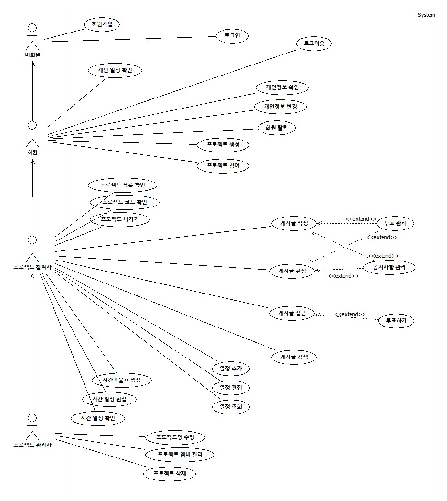

## 2. Use case analysis
### 2.1. Use case diagram

Use case diagram에 관한 고려사항은 아래와 같다.
- 회원은 로그인을 한 사용자이다. '협업의 민족'은 기본적으로 로그인을 하지 않으면 기능을 이용할 수 없다. (회원가입 기능 제외)

[그림 2-1] Use case diagram

### 2.2. Use case description

### Use case #1 회원가입

#### GENERAL CHARACTERISTICS
| | |
| :--- | :--- |
| **Summary** | 웹사이트의 서비스를 사용하기 위한 절차이며, 모든 사용자는 사용에 앞서 회원가입을 해야 한다. |
| **Scope** | 협업의 민족 |
| **Level** | User level |
| **Author** | 박한비 |
| **Last Update** | 2025. 12. 4. |
| **Status** | Analysis |
| **Primary Actor** | 비회원 |
| **Preconditions** | 웹사이트에 접속한 상태여야 한다. |
| **Trigger** | 로그인 페이지에서 회원가입 버튼을 누를 때 |
| **Success Post Condition** | 사용자의 계정이 생성되고, 로그인을 진행할 수 있다. |
| **Failed Post Condition** | 사용자는 회원가입에 실패한다. |

#### MAIN SUCCESS SCENARIO
| Step | Action |
| :--- | :--- |
| S | 사용자가 ‘협업의 민족’을 사용하기 위해 회원가입을 한다. |
| 1 | 사용자는 로그인 페이지에서 회원가입 버튼을 누른다. |
| 2 | 시스템은 회원가입에 필요한 정보(이메일, 비밀번호, 비밀번호 확인)를 표시한다. |
| 3 | 사용자는 정보를 입력하고 중복 확인 버튼을 눌러 이메일 사용 가능 여부를 확인한다. |
| 4 | 시스템은 필수 항목이 모두 충족되었는지, 이메일이 사용 가능한지 확인하고, 모두 충족되었다면 다음 버튼을 활성화한다. |
| 5 | 시스템은 회원가입에 필요한 정보(이름, 전화번호, 전공/직무, 개인정보 수집)를 표시한다. |
| 6 | 시스템은 필수 항목이 모두 충족되었는지 확인하고, 모두 충족되었다면 회원가입 버튼을 활성화한다. |
| 7 | 사용자는 회원가입 버튼을 누른다. |
| 8 | 시스템은 사용자 정보를 저장하고 계정 생성을 완료한다. |

#### EXTENSION SCENARIOS
| Step | Branching Action |
| :--- | :--- |
| 3 | 3a. 입력한 이메일 형식이 올바르지 않은 경우 |
| | 3a.1. 시스템은 이메일 형식 오류 메시지를 출력한다. |
| | 3a.2. 이메일 입력 단계로 돌아간다. (Use case #1-3) |
| | 3b. 이메일이 중복될 경우 |
| | 3b.1. 시스템은 아이디 중복 메시지를 출력한다. |
| | 3b.2. 아이디를 입력하는 단계로 돌아간다. (Use case #1-3) |
| 4 | 4a. 이메일 중복 확인을 진행하지 않은 경우 |
| | 4a.1. 다음 버튼은 비활성화 상태를 유지한다. |
| | 4a.2. 이메일 중복 확인 단계로 돌아간다. (Use case #1-3) |
| | 4b. 두 비밀번호가 일치하지 않을 경우 |
| | 4b.1. 시스템은 오류 메시지를 출력한다. |
| | 4b.2. 비밀번호 입력 단계로 돌아간다. (Use case #1-3) |
| | 4c. 필수 항목을 누락할 경우 |
| | 4c.1. 다음 버튼은 비활성화 상태를 유지한다. |
| | 4c.2. 정보 입력 단계로 돌아간다. (Use case #1-3) |
| 6 | 6a. 전화번호 양식이 올바르지 않을 경우 |
| | 6a.1. 시스템은 입력을 제한한다. |
| | 6b. 필수 항목을 누락할 경우 | 
| | 6b.1. 회원가입 버튼은 비활성화 상태를 유지한다. |
| | 6b.2. 정보 입력 단계로 돌아간다. (Use case #1-5) |

#### RELATED INFORMATION
| | |
| :--- | :--- |
| **Performance** | ≦ 3 Seconds |
| **Frequency** | 제한 없음 |
| **Concurrency** | 제한 없음 |
| **Due Date** | 2025. 12. 12. |

---

### Use case #2 로그인

#### GENERAL CHARACTERISTICS
| | |
| :--- | :--- |
| **Summary** | 웹사이트의 서비스를 사용하기 위해 로그인이 필요하다. |
| **Scope** | 협업의 민족 |
| **Level** | User level |
| **Author** | 박한비 |
| **Last Update** | 2025. 11. 25. |
| **Status** | Analysis |
| **Primary Actor** | 비회원 |
| **Preconditions** | 사용자는 웹사이트에 접속한 상태여야 하고, 회원가입이 완료된 상태여야 한다. |
| **Trigger** | 로그인 페이지에서 로그인 버튼을 누를 때 |
| **Success Post Condition** | 사용자는 로그인에 성공하여 대시보드 페이지로 이동된다. |
| **Failed Post Condition** | 사용자는 로그인에 실패한다. |

#### MAIN SUCCESS SCENARIO
| Step | Action |
| :--- | :--- |
| S | 사용자가 ‘협업의 민족’을 사용하기 위해 로그인을 한다. |
| 1 | 사용자는 ID(이메일)와 비밀번호를 입력하고 로그인 버튼을 누른다. |
| 2 | 시스템은 로그인이 성공 여부를 판단한다. |

#### EXTENSION SCENARIOS
| Step | Branching Action |
| :--- | :--- |
| 2 | 2a. 비밀번호가 일치하지 않을 경우 |
| | 2a.1. 시스템은 오류 메시지를 출력한다. |
| | 2a.2. 비밀번호를 입력하는 단계로 돌아간다. (Use case #2-1) |
| | 2b. 사용자 정보가 존재하지 않을 경우(아이디가 일치하지 않을 경우) |
| | 2b.1. 아이디 칸 아래에 시스템은 오류 메시지를 출력한다. |

#### RELATED INFORMATION
| | |
| :--- | :--- |
| **Performance** | ≦ 3 Seconds |
| **Frequency** | 제한 없음 |
| **Concurrency** | 제한 없음 |
| **Due Date** | 2025. 12. 12. |

---

### Use case #3 개인 일정 확인

#### GENERAL CHARACTERISTICS
| | |
| :--- | :--- |
| **Summary** | 프로젝트의 달력에서 추가한 일정 중 참가자로 있는 일정을 확인한다. |
| **Scope** | 협업의 민족 |
| **Level** | User level |
| **Author** | 박한비 |
| **Last Update** | 2025. 12. 7. |
| **Status** | Analysis |
| **Primary Actor** | 회원 |
| **Preconditions** | 사용자는 로그인된 상태여야 한다. |
| **Trigger** | 메인 페이지에 접근할 때 |
| **Success Post Condition** | 모든 프로젝트에서 참가자로 설정된 일정을 확인한다. |
| **Failed Post Condition** | 시스템이 일정 불러오기에 실패한다. |

#### MAIN SUCCESS SCENARIO
| Step | Action |
| :--- | :--- |
| S | 모든 프로젝트에서 참가자로 설정된 일정을 확인한다. |
| 1 | 사용자는 메인 페이지에 접근한다. |
| 2 | 시스템은 DB에서 사용자가 참가자로 등록된 일정 정보를 불러온다. |
| 3 | 시스템은 불러온 정보를 달력의 해당 일정 날짜에 프로젝트 이름과 일정 이름을 모두 회색 색상으로 화면에 표시한다. |

#### EXTENSION SCENARIOS
| Step | Branching Action |
| :--- | :--- |
| - | - |

#### RELATED INFORMATION
| | |
| :--- | :--- |
| **Performance** | ≦ 3 Seconds |
| **Frequency** | 사용자가 페이지에 접근할 때마다 |
| **Concurrency** | 제한 없음 |
| **Due Date** | 2025. 12. 12. |

---

### Use case #4 개인정보 변경

#### GENERAL CHARACTERISTICS
| | |
| :--- | :--- |
| **Summary** | 회원가입 시 등록한 이름, 비밀번호, 전화번호, 전공/직무를 변경한다. |
| **Scope** | 협업의 민족 |
| **Level** | User level |
| **Author** | 박한비 |
| **Last Update** | 2025. 11. 25. |
| **Status** | Analysis |
| **Primary Actor** | 회원 |
| **Preconditions** | 사용자는 설정 페이지에 접근하여 개인정보 확인을 완료한 상태여야 한다. |
| **Trigger** | 수정하기 버튼을 누를 때 |
| **Success Post Condition** | 사용자의 개인정보가 수정된다. |
| **Failed Post Condition** | 사용자의 개인정보 수정에 실패한다. |

#### MAIN SUCCESS SCENARIO
| Step | Action |
| :--- | :--- |
| S | 회원가입 시 등록한 개인정보를 변경한다. |
| 1 | 사용자는 수정하기 버튼을 누른다. |
| 2 | 변경하고자 하는 정보를 수정한다. |
| 3 | 저장하기 버튼을 누른다. |
| 4 | 동작을 수행한 결과를 시스템은 DB에 저장한다. |

#### EXTENSION SCENARIOS
| Step | Branching Action |
| :--- | :--- |
| 2 | 2a. 사용자의 이름을 변경할 경우 |
| | 2a.1. 변경하고자 하는 이름을 입력한다. |
| | 2b. 사용자의 비밀번호를 변경할 경우 |
| | 2b.1. 사용자는 현재 비밀번호, 새 비밀번호, 새 비밀번호 확인을 입력한다. |
| | 2c. 사용자의 전화번호를 변경할 경우 |
| | 2c.1. 변경하고자 하는 전화번호를 입력한다. |
| | 2d. 전공/직무를 변경할 경우 |
| | 2d.1. 카테고리에서 변경하고자 하는 전공/직무를 선택한다. |
| 3 | 3a. 현재 비밀번호가 일치하지 않을 경우 |
| | 3a.1. 시스템은 오류 메시지를 출력하고, 비밀번호를 입력하는 단계로 돌아간다. (Use case #4-2b) |
| | 3b. 입력한 새 비밀번호가 양식과 다를 경우 |
| | 3b.1. 시스템은 오류 메시지를 출력하고, 비밀번호를 입력하는 단계로 돌아간다. (Use case #4-2b) |
| | 3c. 재입력한 새 비밀번호가 일치하지 않을 경우 |
| | 3c.1. 시스템은 오류 메시지를 출력하고, 비밀번호를 입력하는 단계로 돌아간다. (Use case #4-2b) |

#### RELATED INFORMATION
| | |
| :--- | :--- |
| **Performance** | ≦ 3 Seconds |
| **Frequency** | 사용자가 기능을 실행할 때마다 |
| **Concurrency** | 제한 없음 |
| **Due Date** | 2025. 12. 12. |

---

### Use case #5 회원 탈퇴

#### GENERAL CHARACTERISTICS
| | |
| :--- | :--- |
| **Summary** | 웹사이트 사용을 더 이상 사용하지 않을 사용자들은 회원을 탈퇴한다. |
| **Scope** | 협업의 민족 |
| **Level** | User level |
| **Author** | 박한비 |
| **Last Update** | 2025. 11. 25. |
| **Status** | Analysis |
| **Primary Actor** | 회원 |
| **Preconditions** | 사용자는 설정 페이지에 접근한 상태여야 한다. |
| **Trigger** | 사용자가 회원 탈퇴 버튼을 누를 때 |
| **Success Post Condition** | 사용자의 계정 정보가 ‘협업의 민족’에서 삭제된다. |
| **Failed Post Condition** | 사용자는 회원 탈퇴에 실패한다. |

#### MAIN SUCCESS SCENARIO
| Step | Action |
| :--- | :--- |
| S | 사용자는 ‘협업의 민족’ 웹사이트에서 탈퇴한다. |
| 1 | 회원 탈퇴 버튼을 누른다. |
| 2 | 사용자는 현재 설정된 비밀번호를 입력한다. |
| 3 | 비밀번호가 일치하면 사용자는 시스템에 회원 탈퇴를 요청한다. |
| 4 | 시스템은 DB에서 해당 사용자의 개인 정보만 삭제한다. |

#### EXTENSION SCENARIOS
| Step | Branching Action |
| :--- | :--- |
| 3 | 3a. 비밀번호가 일치하지 않을 경우 |
| | 3a.1. 시스템은 오류 메시지를 출력한다. |
| | 3a.2. 시스템은 회원 탈퇴 창을 닫는다. |

#### RELATED INFORMATION
| | |
| :--- | :--- |
| **Performance** | ≦ 3 Seconds |
| **Frequency** | 사용자 당 1번 |
| **Concurrency** | 제한 없음 |
| **Due Date** | 2025. 12. 12. |

---

### Use case #6 프로젝트 생성

#### GENERAL CHARACTERISTICS
| | |
| :--- | :--- |
| **Summary** | 다른 사용자와 공유하기 위한 새로운 프로젝트를 생성한다. |
| **Scope** | 협업의 민족 |
| **Level** | User level |
| **Author** | 박한비 |
| **Last Update** | 2025. 11. 25. |
| **Status** | Analysis |
| **Primary Actor** | 회원 |
| **Preconditions** | 사용자는 로그인된 상태여야 한다. |
| **Trigger** | 프로젝트 생성 버튼을 누를 때 |
| **Success Post Condition** | 새로운 프로젝트 생성에 성공하여 목록에 추가된다. |
| **Failed Post Condition** | 새로운 프로젝트 생성에 실패한다. |

#### MAIN SUCCESS SCENARIO
| Step | Action |
| :--- | :--- |
| S | 협업을 위한 새로운 프로젝트를 생성한다. |
| 1 | 프로젝트 생성하기 버튼을 누른다. |
| 2 | 시스템은 '새 프로젝트'라는 이름의 프로젝트를 생성한다. |
| 3 | 시스템은 프로젝트를 생성하고 영어와 숫자가 랜덤으로 섞인 6자리 참여코드를 부여한다. |
| 4 | 시스템은 프로젝트를 생성한 사용자에게 관리자 권한을 부여한다. |
| 5 | 시스템은 사용자를 프로젝트 관리 페이지로 이동시킨다. |

#### EXTENSION SCENARIOS
| Step | Branching Action |
| :--- | :--- |
| - | - |

#### RELATED INFORMATION
| | |
| :--- | :--- |
| **Performance** | ≦ 3 Seconds |
| **Frequency** | 사용자가 기능을 실행할 때마다 |
| **Concurrency** | 제한 없음 |
| **Due Date** | 2025. 12. 12. |

---

### Use case #7 프로젝트 접근

#### GENERAL CHARACTERISTICS
| | |
| :--- | :--- |
| **Summary** | 확인하고자 하는 프로젝트에 접근한다. |
| **Scope** | 협업의 민족 |
| **Level** | User level |
| **Author** | 박한비 |
| **Last Update** | 2025. 11. 25. |
| **Status** | Analysis |
| **Primary Actor** | 프로젝트 참여자 |
| **Preconditions** | 사용자가 참여 중인 프로젝트가 최소 1개는 존재해야 한다. |
| **Trigger** | 프로젝트 목록에서 프로젝트 이름을 누를 때 |
| **Success Post Condition** | 선택한 프로젝트의 페이지로 이동된다. |
| **Failed Post Condition** | 선택한 프로젝트의 페이지로 이동 실패한다. |

#### MAIN SUCCESS SCENARIO
| Step | Action |
| :--- | :--- |
| S | 확인하고자 하는 프로젝트를 조회한다. |
| 1 | 프로젝트 목록에서 확인하고자 하는 프로젝트의 이름을 누른다. |
| 2 | 사용자는 선택한 프로젝트의 페이지로 이동된다. |

#### EXTENSION SCENARIOS
| Step | Branching Action |
| :--- | :--- |
| - | - |

#### RELATED INFORMATION
| | |
| :--- | :--- |
| **Performance** | ≦ 3 Seconds |
| **Frequency** | 사용자가 기능을 실행할 때마다 |
| **Concurrency** | 제한 없음 |
| **Due Date** | 2025. 12. 12. |

---

### Use case #8 프로젝트명 수정

#### GENERAL CHARACTERISTICS
| | |
| :--- | :--- |
| **Summary** | 프로젝트의 이름을 수정한다. |
| **Scope** | 협업의 민족 |
| **Level** | User level |
| **Author** | 박한비 |
| **Last Update** | 2025. 11. 25. |
| **Status** | Analysis |
| **Primary Actor** | 프로젝트 관리자 |
| **Preconditions** | 사용자는 해당 프로젝트의 관리자 권한을 가지고, 프로젝트 관리 페이지에 접근한 상태여야 한다. |
| **Trigger** | 프로젝트 명 수정 버튼을 누를 때 |
| **Success Post Condition** | 프로젝트 명이 수정된다. |
| **Failed Post Condition** | 프로젝트 명 수정에 실패한다. |

#### MAIN SUCCESS SCENARIO
| Step | Action |
| :--- | :--- |
| S | 프로젝트명을 수정한다. |
| 1 | 프로젝트명 옆의 수정 버튼을 누른다. |
| 2 | 사용자는 수정한 프로젝트명을 입력한다. |
| 3 | 시스템은 DB에 변경된 프로젝트 명을 저장하고, 모든 참여자의 프로젝트 목록에 즉시 반영한다. |

#### EXTENSION SCENARIOS
| Step | Branching Action |
| :--- | :--- |
| - | - |

#### RELATED INFORMATION
| | |
| :--- | :--- |
| **Performance** | ≦ 3 Seconds |
| **Frequency** | 사용자가 기능을 실행할 때마다 |
| **Concurrency** | 제한 없음 |
| **Due Date** | 2025. 12. 12. |

---

### Use case #9 프로젝트 코드 확인

#### GENERAL CHARACTERISTICS
| | |
| :--- | :--- |
| **Summary** | 프로젝트에 부여된 참여코드를 확인한다. |
| **Scope** | 협업의 민족 |
| **Level** | User level |
| **Author** | 박한비 |
| **Last Update** | 2025. 11. 25. |
| **Status** | Analysis |
| **Primary Actor** | 프로젝트 참여자 |
| **Preconditions** | 프로젝트 관리 페이지에 접근한 상태여야 한다. |
| **Trigger** | 프로젝트 관리 페이지에 접근할 때 |
| **Success Post Condition** | 사용자가 프로젝트 참여코드를 확인한다. |
| **Failed Post Condition** | 시스템이 참여코드 불러오기에 실패한다. |

#### MAIN SUCCESS SCENARIO
| Step | Action |
| :--- | :--- |
| S | 사용자가 프로젝트 참여코드를 확인한다. |
| 1 | 사용자는 프로젝트 관리 페이지에 접근한다. |
| 2 | 시스템은 DB에서 해당 프로젝트의 참여코드를 불러온다. |
| 3 | 시스템은 불러온 참여코드를 화면에 표시한다. |

#### EXTENSION SCENARIOS
| Step | Branching Action |
| :--- | :--- |
| - | - |

#### RELATED INFORMATION
| | |
| :--- | :--- |
| **Performance** | ≦ 3 Seconds |
| **Frequency** | 사용자가 기능을 실행할 때마다 |
| **Concurrency** | 제한 없음 |
| **Due Date** | 2025. 12. 12. |

---

### Use case #10 프로젝트 멤버 관리

#### GENERAL CHARACTERISTICS
| | |
| :--- | :--- |
| **Summary** | 프로젝트 참여 요청을 승인 또는 거절하거나, 프로젝트에 참여 중인 멤버를 삭제하거나 관리자 권한을 양도한다. |
| **Scope** | 협업의 민족 |
| **Level** | User level |
| **Author** | 박한비 |
| **Last Update** | 2025. 11. 25. |
| **Status** | Analysis |
| **Primary Actor** | 프로젝트 관리자 |
| **Preconditions** | 사용자는 해당 프로젝트의 관리자 권한을 가지고, 프로젝트 관리 페이지에 접근한 상태여야 한다. 또한, 승인 대기 중인 사용자가 최소 1명 존재하거나, 관리자를 제외한 참여 멤버가 최소 1명 존재해야 한다. |
| **Trigger** | 승인 대기 멤버 칸의 승인 또는 거절 아이콘을 누르거나 프로젝트 멤버 칸의 삭제 또는 관리자 권한 넘기기 아이콘을 누를 때 |
| **Success Post Condition** | 참여 요청의 승인/거절이 성공하거나, 멤버 삭제 또는 관리자 권한 양도에 성공한다. |
| **Failed Post Condition** | 멤버 관리 작업에 실패한다. |

#### MAIN SUCCESS SCENARIO
| Step | Action |
| :--- | :--- |
| S | 관리자가 프로젝트 참여 요청을 관리하거나, 기존 멤버의 권한을 관리한다. |
| 1 | 관리자는 승인 대기 멤버 목록 또는 프로젝트 멤버 목록에서 원하는 동작의 아이콘을 선택한다. |
| 2 | 선택한 동작에 따라 시스템은 요청을 처리하고 화면을 업데이트하여 표시한다. |

#### EXTENSION SCENARIOS
| Step | Branching Action |
| :--- | :--- |
| 2 | 2a. 승인 아이콘을 선택할 경우 (참여 요청 관리) |
| | 2a.1. 승인 대기 멤버DB에서 해당 멤버가 삭제된다. |
| | 2a.2. 프로젝트 멤버 칸에 승인된 멤버가 추가된다. |
| | 2b. 거절 아이콘을 선택할 경우 (참여 요청 관리) |
| | 2b.1. 승인 대기 멤버 칸에서 해당 멤버가 사라진다. |
| | 2c. 멤버 삭제 아이콘을 선택할 경우 (프로젝트 멤버 관리) |
| | 2c.1. 프로젝트 멤버 칸에서 해당 멤버가 사라진다. |
| | 2d. 관리자 권한 양도 아이콘을 선택할 경우 (프로젝트 멤버 관리) |
| | 2d.1. 관리자 권한이 해당 멤버에게 양도된다. |
| | 2d.2. 기존에 관리자였던 사용자의 관리자 권한이 사라진다. |

#### RELATED INFORMATION
| | |
| :--- | :--- |
| **Performance** | ≦ 3 Seconds |
| **Frequency** | 사용자가 기능을 실행할 때마다 |
| **Concurrency** | 제한 없음 |
| **Due Date** | 2025. 12. 12. |

---

### Use case #11 프로젝트 삭제

#### GENERAL CHARACTERISTICS
| | |
| :--- | :--- |
| **Summary** | 더 이상 사용하지 않는 프로젝트를 영구적으로 삭제한다. |
| **Scope** | 협업의 민족 |
| **Level** | User level |
| **Author** | 박한비 |
| **Last Update** | 2025. 12. 4. |
| **Status** | Analysis |
| **Primary Actor** | 프로젝트 관리자 |
| **Preconditions** | 사용자는 해당 프로젝트의 관리자 권한을 가지고, 프로젝트 관리 페이지에 접근한 상태여야 하며, 관리자를 제외한 사용자가 아무도 없어야 한다. |
| **Trigger** | 프로젝트 삭제 버튼을 누를 때 |
| **Success Post Condition** | 해당 프로젝트의 모든 내용이 ‘협업의 민족’에서 삭제된다. |
| **Failed Post Condition** | 프로젝트 삭제에 실패한다. |

#### MAIN SUCCESS SCENARIO
| Step | Action |
| :--- | :--- |
| S | 더 이상 사용하지 않는 프로젝트를 영구적으로 삭제한다. |
| 1 | 프로젝트 삭제 버튼을 누른다. |
| 2 | 사용자는 해당 프로젝트의 명을 입력한다. |
| 3 | 시스템은 입력한 내용이 프로젝트 명과 일치하면 프로젝트 삭제 버튼을 활성화 한다. |
| 4 | 일치할 경우, 해당 프로젝트는 DB에서 삭제된다. |

#### EXTENSION SCENARIOS
| Step | Branching Action |
| :--- | :--- |
| 3 | 3a. 프로젝트 명이 일치하지 않을 경우 |
| | 3a.1. 프로젝트 삭제 버튼은 비활성화 상태를 유지한다. |
| 4 | 4a. 프로젝트 삭제 시 |
| | 4a.1. DB에서 모든 관련 데이터가 영구적으로 삭제되어 복구할 수 없다. |

#### RELATED INFORMATION
| | |
| :--- | :--- |
| **Performance** | ≦ 3 Seconds |
| **Frequency** | 사용자가 기능을 실행할 때마다 |
| **Concurrency** | 제한 없음 |
| **Due Date** | 2025. 12. 12. |

---

### Use case #12 프로젝트 참여

#### GENERAL CHARACTERISTICS
| | |
| :--- | :--- |
| **Summary** | 관리자가 생성한 프로젝트에 참여하기 위한 요청을 보낸다. |
| **Scope** | 협업의 민족 |
| **Level** | User level |
| **Author** | 박한비 |
| **Last Update** | 2025. 12. 7. |
| **Status** | Analysis |
| **Primary Actor** | 회원 |
| **Preconditions** | 사용자는 참여하고자 하는 프로젝트가 생성되어 있어야 하고, 프로젝트 참여코드를 알고 있는 상태여야 한다. |
| **Trigger** | 대시보드 페이지의 검색창을 누를 때 |
| **Success Post Condition** | 프로젝트에 참여 요청을 보낸다. |
| **Failed Post Condition** | 프로젝트 참여 요청 보내기에 실패한다. |

#### MAIN SUCCESS SCENARIO
| Step | Action |
| :--- | :--- |
| S | 프로젝트에 참여하기 위해 참여 요청을 보낸다. |
| 1 | 대시보드 페이지의 검색창을 누른다. |
| 2 | 사용자는 참여하고자 하는 프로젝트의 참여코드를 입력한다. |
| 3 | 사용자는 Enter 키를 눌러 프로젝트 참여 요청을 보낸다. |

#### EXTENSION SCENARIOS
| Step | Branching Action |
| :--- | :--- |
| 3 | 3a. 참여코드가 일치하지 않을 경우 |
| | 3a.1. 오류 메시지가 출력된다. |
| | 3a.2. 참여코드를 입력하는 단계로 돌아간다. (Use case #12-2) |

#### RELATED INFORMATION
| | |
| :--- | :--- |
| **Performance** | ≦ 3 Seconds |
| **Frequency** | 사용자가 기능을 실행할 때마다 |
| **Concurrency** | 제한 없음 |
| **Due Date** | 2025. 12. 12. |

---

### Use case #13 프로젝트 나가기

#### GENERAL CHARACTERISTICS
| | |
| :--- | :--- |
| **Summary** | 참여 중인 프로젝트 중 더 이상 참여를 원하지 않는 프로젝트에서 나간다. |
| **Scope** | 협업의 민족 |
| **Level** | User level |
| **Author** | 박한비 |
| **Last Update** | 2025. 12. 4. |
| **Status** | Analysis |
| **Primary Actor** | 프로젝트 참여자 |
| **Preconditions** | 관리자 권한을 가지지 않은 사용자가 프로젝트 관리 페이지에 접근한 상태여야 한다. |
| **Trigger** | 프로젝트 나가기 버튼을 누를 때 |
| **Success Post Condition** | 해당 프로젝트에서 사용자의 참여 정보가 삭제된다. |
| **Failed Post Condition** | 프로젝트 나가기에 실패한다. |

#### MAIN SUCCESS SCENARIO
| Step | Action |
| :--- | :--- |
| S | 사용자는 더 이상 사용하지 않는 프로젝트에서 나간다. |
| 1 | 프로젝트 나가기 버튼을 누른다. |
| 2 | 사용자는 해당 프로젝트의 명을 입력한다. |
| 3 | 시스템은 입력한 내용이 프로젝트 명과 일치하면 프로젝트 삭제 버튼을 활성화 한다. |
| 4 | 일치할 경우, 프로젝트 참여자 목록에서 사용자는 삭제된다. |

#### EXTENSION SCENARIOS
| Step | Branching Action |
| :--- | :--- |
| 3 | 3a. 프로젝트 명이 일치하지 않을 경우 |
| | 3a.1. 프로젝트 나가기 버튼은 비활성화 상태를 유지한다. |

#### RELATED INFORMATION
| | |
| :--- | :--- |
| **Performance** | ≦ 3 Seconds |
| **Frequency** | 사용자가 기능을 실행할 때마다 |
| **Concurrency** | 제한 없음 |
| **Due Date** | 2025. 12. 12. |

---

### Use case #14 일정 추가

#### GENERAL CHARACTERISTICS
| | |
| :--- | :--- |
| **Summary** | 캘린더 형식으로, 해야 하는 일정을 추가한다. |
| **Scope** | 협업의 민족 |
| **Level** | User level |
| **Author** | 박한비 |
| **Last Update** | 2025. 11. 25. |
| **Status** | Analysis |
| **Primary Actor** | 프로젝트 참여자 |
| **Preconditions** | 프로젝트의 달력 페이지에 접근한 상태여야 한다. |
| **Trigger** | 일정 추가 버튼을 누를 때 |
| **Success Post Condition** | 새로운 일정 생성에 성공하여 목록에 추가된다. |
| **Failed Post Condition** | 새로운 일정 생성에 실패한다. |

#### MAIN SUCCESS SCENARIO
| Step | Action |
| :--- | :--- |
| S | 프로젝트 진행에 필요한 일정들을 추가한다. |
| 1 | 일정을 추가하고자 하는 날짜를 선택한다. |
| 2 | 사용자는 사이드 바의 일정 추가 버튼을 누른다. |
| 3 | 사용자는 일정 명, 기간, 내용, 참가자 등 상세 정보를 작성하여 저장버튼을 누른다. |
| 4 | 시스템은 작성한 정보를 DB에 저장한다. |
| 5 | 일정 저장에 성공하면, 일정이 추가되었다는 메시지를 화면에 출력한다. |

#### EXTENSION SCENARIOS
| Step | Branching Action |
| :--- | :--- |
| 3 | 3a. 일정 추가 작업을 취소하고 싶은 경우 |
| | 3a.1. 취소 버튼을 누른다. |
| | 3b. 태그 색상을 변경하고 싶은 경우 |
| | 3b.1. 태그 색상은 제공된 색상만 이용 가능하다. |

#### RELATED INFORMATION
| | |
| :--- | :--- |
| **Performance** | ≦ 3 Seconds |
| **Frequency** | 사용자가 기능을 실행할 때마다 |
| **Concurrency** | 제한 없음 |
| **Due Date** | 2025. 12. 12. |

---

### Use case #15 일정 편집

#### GENERAL CHARACTERISTICS
| | |
| :--- | :--- |
| **Summary** | 생성한 일정의 내용 수정 및 필요 없는 일정을 삭제한다. |
| **Scope** | 협업의 민족 |
| **Level** | User level |
| **Author** | 박한비 |
| **Last Update** | 2025. 12. 4. |
| **Status** | Analysis |
| **Primary Actor** | 프로젝트 참여자 |
| **Preconditions** | 프로젝트의 달력 페이지에 접근한 상태여야 하고, 추가된 일정이 최소 1개 이상 존재해야 하며, 해당 일정의 작성자, 참가자로 추가된 사용자여야 한다. |
| **Trigger** | 일정 수정 또는 삭제 아이콘을 누를 때 |
| **Success Post Condition** | 등록한 일정의 수정 또는 삭제에 성공한다. |
| **Failed Post Condition** | 등록한 일정의 수정 또는 삭제에 실패한다. |

#### MAIN SUCCESS SCENARIO
| Step | Action |
| :--- | :--- |
| S | 이미 추가된 일정의 내용을 수정 또는 삭제한다. |
| 1 | 사용자는 일정을 수정 또는 삭제하고자 하는 날짜를 선택한다. |
| 2 | 사이드 바의 해당 일정의 수정, 삭제 아이콘 또는 일정 조회 후 수정, 삭제 버튼을 누른다. |
| 3 | 일정의 내용을 수정하여 저장하거나 삭제한다. |
| 4 | 동작을 수행한 결과를 시스템은 해당 날짜에 적용하여 달력에 일정 목록을 표시한다. |

#### EXTENSION SCENARIOS
| Step | Branching Action |
| :--- | :--- |
| 2 | 2a. 수정을 선택할 경우 |
| | 2a.1. 일정 수정 단계로 이동한다. (Use case #15-3a) |
| | 2b. 삭제를 선택할 경우 |
| | 2b.1. 일정 삭제 단계로 이동한다. (Use case #15-3b) |
| 3 | 3a. 일정을 수정할 경우 |
| | 3a.1. 저장된 내용을 DB에서 불러와 화면에 표시한다. |
| | 3a.2. 상세 정보를 수정하여 저장한다. |
| | 3a.3. 시스템은 DB 정보를 업데이트한다. |
| | 3b. 일정을 삭제할 경우 |
| | 3b.1. 해당 일정이 삭제된다. |
| | 3b.2. 시스템은 DB에서 정보를 삭제한다. |

#### RELATED INFORMATION
| | |
| :--- | :--- |
| **Performance** | ≦ 3 Seconds |
| **Frequency** | 사용자가 기능을 실행할 때마다 |
| **Concurrency** | 제한 없음 |
| **Due Date** | 2025. 12. 12. |

---

### Use case #16 일정 조회

#### GENERAL CHARACTERISTICS
| | |
| :--- | :--- |
| **Summary** | 상세 정보를 확인하고 싶은 일정을 조회한다. |
| **Scope** | 협업의 민족 |
| **Level** | User level |
| **Author** | 박한비 |
| **Last Update** | 2025. 12. 4. |
| **Status** | Analysis |
| **Primary Actor** | 프로젝트 참여자 |
| **Preconditions** | 프로젝트의 달력 페이지에 접근한 상태여야 하고, 추가된 일정이 최소 1개 이상 존재해야 한다. |
| **Trigger** | 조회하고자 하는 일정이 포함된 날짜를 선택할 때 |
| **Success Post Condition** | 선택한 일정의 상세 정보를 확인할 수 있다. |
| **Failed Post Condition** | 선택한 일정의 상세 정보를 불러오기에 실패한다. |

#### MAIN SUCCESS SCENARIO
| Step | Action |
| :--- | :--- |
| S | 상세 정보를 확인하고 싶은 일정을 조회한다. |
| 1 | 일정을 조회하고자 하는 날짜를 선택한다. |
| 2 | 사이드 바에서 조회하려는 일정을 누른다. |
| 3 | 시스템은 DB에서 해당 일정의 저장된 정보를 불러온다. |
| 4 | 시스템은 불러온 일정의 상세 정보를 사이드 바 화면에 표시한다. |

#### EXTENSION SCENARIOS
| Step | Branching Action |
| :--- | :--- |
| - | - |

#### RELATED INFORMATION
| | |
| :--- | :--- |
| **Performance** | ≦ 3 Seconds |
| **Frequency** | 사용자가 기능을 실행할 때마다 |
| **Concurrency** | 제한 없음 |
| **Due Date** | 2025. 12. 12. |

---

### Use case #17 게시글 작성

#### GENERAL CHARACTERISTICS
| | |
| :--- | :--- |
| **Summary** | 프로젝트에 참여한 다른 사용자들과 의견 공유 가능한 게시글을 작성한다. |
| **Scope** | 협업의 민족 |
| **Level** | User level |
| **Author** | 박한비 |
| **Last Update** | 2025. 12. 4. |
| **Status** | Analysis |
| **Primary Actor** | 프로젝트 참여자 |
| **Preconditions** | 프로젝트의 게시판 페이지에 접근한 상태여야 한다. |
| **Trigger** | 게시글 작성 버튼을 누를 때 |
| **Success Post Condition** | 게시판에 사용자가 작성한 게시글이 등록된다. |
| **Failed Post Condition** | 사용자는 게시글 작성에 실패한다. |

#### MAIN SUCCESS SCENARIO
| Step | Action |
| :--- | :--- |
| S | 게시판에 게시글을 작성한다. |
| 1 | 게시판 페이지에서 게시글 작성 버튼을 누른다. |
| 2 | 시스템은 게시글 작성 페이지로 이동한다. |
| 3 | 사용자는 게시글의 제목과 내용을 작성한다. |
| 4 | 시스템은 DB에 사용자가 작성한 게시글의 모든 내용과 작성 정보를 저장한다. |
| 5 | 게시글 등록이 완료되면, 사용자는 작성한 게시글 페이지로 이동되어 작성한 게시글을 확인한다. |

#### EXTENSION SCENARIOS
| Step | Branching Action |
| :--- | :--- |
| 3 | 3a. 투표 생성을 선택할 경우 |
| | 3a.1. 투표 추가를 선택하여 새 투표를 생성한다. |
| | 3a.2. 시스템은 투표 작성 모달창을 화면에 표시한다. |
| | 3a.3. 사용자는 투표 생성에 필요한 내용을 작성한다. |
| | 3a.4. 투표 생성 버튼을 눌러 투표를 생성한다. |
| | 3b. 투표 정보가 하나라도 입력되지 않을 경우 |
| | 3b.1. 시스템은 오류 메시지를 화면에 출력한다. |
| | 3b.2. 투표 정보 입력 단계로 돌아간다. (Use case #17-3b.3) |
| | 3c. 공지사항으로 등록할 경우 |
| | 3c.1. 공지사항 유무 체크 박스를 선택한다. | 
| | 3d. 공지사항의 개수가 10개를 초과하게 될 경우 |
| | 3d.1. 공지사항 유무 체크 박스가 비활성화 되며, 이미 공지사항이 10개라는 문구를 출력한다. |
| 4 | 4a. 게시글의 제목이 입력되지 않을 경우 |
| | 4a.1. 시스템은 오류 메시지를 출력한다. |
| | 4a.2. 게시글 작성 단계로 돌아간다. (Use case #17-3) |

#### RELATED INFORMATION
| | |
| :--- | :--- |
| **Performance** | ≦ 3 Seconds |
| **Frequency** | 사용자가 기능을 실행할 때마다 |
| **Concurrency** | 제한 없음 |
| **Due Date** | 2025. 12. 12. |

---

### Use case #18 게시글 편집

#### GENERAL CHARACTERISTICS
| | |
| :--- | :--- |
| **Summary** | 작성한 게시글의 제목, 내용 등의 수정 및 게시글을 삭제한다. |
| **Scope** | 협업의 민족 |
| **Level** | User level |
| **Author** | 박한비 |
| **Last Update** | 2025. 12. 4. |
| **Status** | Analysis |
| **Primary Actor** | 프로젝트 참여자 |
| **Preconditions** | 프로젝트의 게시판 페이지에 접근한 상태여야 하고, 게시글의 작성자가 사용자 본인이어야 하며, 사용자가 작성한 게시글이 최소 1개는 존재해야 한다. |
| **Trigger** | 게시글 수정 또는 삭제 버튼을 누를 때 |
| **Success Post Condition** | 작성한 게시글의 수정 또는 삭제에 성공한다. |
| **Failed Post Condition** | 작성한 게시글의 수정 또는 삭제에 실패한다. |

#### MAIN SUCCESS SCENARIO
| Step | Action |
| :--- | :--- |
| S | 본인이 작성한 게시글의 내용을 수정 또는 삭제한다. |
| 1 | 수정하고자 하는 게시글을 선택한다. |
| 2 | 게시글 수정 또는 삭제 버튼을 누른다. |
| 3 | 게시글의 내용을 수정하여 다시 저장하거나 삭제한다. |
| 4 | 동작을 수행한 결과를 시스템은 화면에 표시한다. |

#### EXTENSION SCENARIOS
| Step | Branching Action |
| :--- | :--- |
| 2 | 2a. 수정을 선택할 경우 |
| | 2a.1. 게시글 수정 단계로 이동한다. (Use case #18-3a) |
| | 2b. 삭제을 선택할 경우 |
| | 2b.1. 게시글 삭제 단계로 이동한다. (Use case #18-3b) |
| 3 | 3a. 게시글을 수정할 경우 |
| | 3a.1. 저장된 내용을 DB에서 불러와 게시글 입력 단계로 돌아간다. |
| | 3a.2. 게시글의 내용을 변경하여 저장한다. |
| | 3a.3. 공지사항 등록할 경우 |
| | 3a.3.ⅰ. Use case #17-3d의 시나리오와 동일하다. |
| | 3a.4. 공지사항 해제할 경우 |
| | 3a.4.ⅰ. 공지사항 유무 체크 박스를 선택 해제 한다. |
| | 3a.5. 시스템은 DB에 정보를 업데이트 한다. |
| | 3b. 게시글을 삭제할 경우 |
| | 3b.1. 삭제 버튼을 누른다. |
| | 3b.2. 작성된 게시글이 삭제된다. |
| | 3b.3. 시스템은 DB에서 정보를 삭제한다. |
| 4 | 4a. 게시글이 수정될 경우 |
| | 4a.1. 작성한 게시글 페이지에서 내용을 확인한다. |
| | 4b. 게시글이 삭제될 경우 |
| | 4b.1. 사용자는 게시판 페이지로 이동된다. |

#### RELATED INFORMATION
| | |
| :--- | :--- |
| **Performance** | ≦ 3 Seconds |
| **Frequency** | 사용자가 기능을 실행할 때마다 |
| **Concurrency** | 제한 없음 |
| **Due Date** | 2025. 12. 12. |

---

### Use case #19 게시글 접근

#### GENERAL CHARACTERISTICS
| | |
| :--- | :--- |
| **Summary** | 게시판에 있는 사용자들의 게시글 중 확인하고자 하는 게시글을 조회한다. |
| **Scope** | 협업의 민족 |
| **Level** | User level |
| **Author** | 박한비 |
| **Last Update** | 2025. 12. 4. |
| **Status** | Analysis |
| **Primary Actor** | 프로젝트 참여자 |
| **Preconditions** | 프로젝트의 게시판 페이지에 접근한 상태여야 하고, 작성된 게시글이 최소 1개 이상 존재해야 한다. |
| **Trigger** | 조회하고자 하는 게시글을 선택할 때 |
| **Success Post Condition** | 선택한 게시글의 페이지로 이동되어 작성된 게시글의 내용을 확인할 수 있다. |
| **Failed Post Condition** | 선택한 게시글의 내용을 불러오기에 실패한다. |

#### MAIN SUCCESS SCENARIO
| Step | Action |
| :--- | :--- |
| S | 게시판의 게시글 중 확인하고 싶은 게시글을 조회한다. |
| 1 | 게시판 목록에서 조회하고자 하는 게시글을 선택한다. |
| 2 | 시스템은 DB에서 선택된 게시글의 정보를 불러온다. |
| 3 | 시스템은 작성한 게시글 페이지로 이동하여 불러온 게시글의 내용을 표시한다. |
| 4 | 사용자는 게시글에 따라 추가적인 기능을 사용한다. |

#### EXTENSION SCENARIOS
| Step | Branching Action |
| :--- | :--- |
| 4 | 4a. 투표에 참여를 원할 경우 |
| | 4a.1. 마감기한이 지나지 않은 투표를 포함하는 게시글을 조회한다. |
| | 4a.2. 투표 창의 원하는 선택지를 선택하여 투표하기 버튼을 누른다. |
| | 4a.3. 시스템은 사용자의 투표 내역을 DB에 저장한다. |
| | 4a.4. 투표는 기본적으로 하나만 선택 가능하며, 옵션에 따라 중복 투표가 가능할 수 있다. |
| | 4a.5. 투표를 완료했다면, 투표 현황을 볼 수 있다. |
| | 4a.6. 이미 투표를 한 상태이고 마감 전이면 재투표하기 버튼을 누른다. |
| | 4a.7. 투표 창의 변경하고자 하는 선택지로 선택하여 투표하기 버튼을 누른다. |
| | 4a.8. 시스템은 사용자의 투표 내역을 DB에 저장한다. |

#### RELATED INFORMATION
| | |
| :--- | :--- |
| **Performance** | ≦ 3 Seconds |
| **Frequency** | 사용자가 기능을 실행할 때마다 |
| **Concurrency** | 제한 없음 |
| **Due Date** | 2025. 12. 12. |

---

### Use case #20 시간조율표 생성

#### GENERAL CHARACTERISTICS
| | |
| :--- | :--- |
| **Summary** | 사용자들이 가능한 시간을 비교할 수 있도록 특정 기간의 시간조율표를 생성한다. |
| **Scope** | 협업의 민족 |
| **Level** | User level |
| **Author** | 박한비 |
| **Last Update** | 2025. 11. 25. |
| **Status** | Analysis |
| **Primary Actor** | 프로젝트 참여자 |
| **Preconditions** | 프로젝트 시간조율표 생성 페이지에 접근한 상태여야 한다. |
| **Trigger** | 생성 버튼을 누를 때 |
| **Success Post Condition** | 사용자가 설정한 정보로 시간조율표가 생성되고 리스트에 표시된다. |
| **Failed Post Condition** | 시간조율표 생성에 실패한다. |

#### MAIN SUCCESS SCENARIO
| Step | Action |
| :--- | :--- |
| S | 사용자들 간의 시간을 조율하기 위한 표를 생성한다. |
| 1 | 사용자는 시간조율표 생성 페이지에서 표 이름, 시작 날짜, 생성 개수(열 개수), 시작 및 종료 시간대를 입력 및 선택한다. |
| 2 | 생성 버튼을 눌러 시간조율표를 생성한다. |
| 3 | 시스템은 DB에 표 생성 정보를 저장한다. |
| 4 | 시스템은 페이지 하단의 리스트에 생성된 표 이름을 출력한다. |

#### EXTENSION SCENARIOS
| Step | Branching Action |
| :--- | :--- |
| 2 | 2a. 이름이 입력되지 않을 경우 |
| | 2a.1. 시스템은 오류 메시지를 출력한다. |
| | 2a.2. 표 정보 입력 단계로 돌아간다. (Use case #20-1) |
| | 2b. 열 생성 개수가 선택되지 않을 경우 |
| | 2b.1. 시스템은 오류 메시지를 출력한다. |
| | 2b.2. 표 정보 입력 단계로 돌아간다. (Use case #20-1) |

#### RELATED INFORMATION
| | |
| :--- | :--- |
| **Performance** | ≦ 3 Seconds |
| **Frequency** | 사용자가 기능을 실행할 때마다 |
| **Concurrency** | 제한 없음 |
| **Due Date** | 2025. 12. 12. |

---

### Use case #21 시간 일정 편집

#### GENERAL CHARACTERISTICS
| | |
| :--- | :--- |
| **Summary** | 생성된 시간조율표의 왼쪽 표에 자신이 가능한 시간대를 드래그하여 표시한다. |
| **Scope** | 협업의 민족 |
| **Level** | User level |
| **Author** | 박한비 |
| **Last Update** | 2025. 11. 25. |
| **Status** | Analysis |
| **Primary Actor** | 프로젝트 참여자 |
| **Preconditions** | 프로젝트의 시간조율 페이지에 접근한 상태여야 하고, 생성된 시간조율표가 존재해야 한다. |
| **Trigger** | 리스트에서 편집할 표 이름을 선택한 후, 왼쪽 표에서 시간대를 드래그할 때 |
| **Success Post Condition** | 자신의 가능한 시간 정보가 DB에 저장되고, 오른쪽 표에 반영된다. |
| **Failed Post Condition** | 시간 편집 정보 저장에 실패한다. |

#### MAIN SUCCESS SCENARIO
| Step | Action |
| :--- | :--- |
| S | 사용자가 가능한 시간대를 왼쪽 표에 표시한다. |
| 1 | 생성한 표 리스트에서 편집하고자 하는 표 이름을 선택한다. |
| 2 | 시스템은 DB에서 해당 표의 정보를 불러와 화면에 표시한다. |
| 3 | 사용자가 왼쪽 표에서 원하는 시간대를 마우스의 왼쪽 키를 누른 채로 드래그한다. |
| 4 | 시스템은 DB에 편집 정보를 저장하고, 오른쪽 표에도 반영하여 시간대 별로 가능한 사람 수에 비례해서 색의 진하기를 조절하여 출력한다. |

#### EXTENSION SCENARIOS
| Step | Branching Action |
| :--- | :--- |
| 4 | 4a. 시간 일정을 추가할 경우 |
| | 4a.1. 사용자는 표의 빈 부분 위에서 원하는 시간대까지 드래그한다. |
| | 4b. 시간 일정을 삭제할 경우 |
| | 4b.1. 사용자는 이미 채워진 부분 위에서 원하는 시간대까지 드래그한다. |

#### RELATED INFORMATION
| | |
| :--- | :--- |
| **Performance** | ≦ 3 Seconds |
| **Frequency** | 사용자가 기능을 실행할 때마다 |
| **Concurrency** | 제한 없음 |
| **Due Date** | 2025. 12. 12. |

---

### Use case #22 시간 일정 확인

#### GENERAL CHARACTERISTICS
| | |
| :--- | :--- |
| **Summary** | 생성된 시간조율표의 오른쪽 표에서 프로젝트 참여자들의 종합적인 가능 시간대를 확인한다. |
| **Scope** | 협업의 민족 |
| **Level** | User level |
| **Author** | 박한비 |
| **Last Update** | 2025. 11. 25. |
| **Status** | Analysis |
| **Primary Actor** | 프로젝트 참여자 |
| **Preconditions** | 프로젝트의 시간조율 페이지에 접근한 상태여야 하고, 생성된 시간조율표가 존재해야 한다. |
| **Trigger** | 리스트에서 확인하고자 하는 표 이름을 선택할 때 |
| **Success Post Condition** | 참여자들의 시간 일정이 누적된 표를 확인한다. |
| **Failed Post Condition** | 시간조율표 정보를 불러오는 데 실패한다. |

#### MAIN SUCCESS SCENARIO
| Step | Action |
| :--- | :--- |
| S | 사용자가 참여자들의 가능 시간대를 확인한다. |
| 1 | 사용자가 리스트에서 확인하고자 하는 표 이름을 선택한다. |
| 2 | 시스템은 DB에서 해당 표에 대해 자신 및 다른 사용자가 편집한 모든 시간 정보를 불러온다. |
| 3 | 시스템은 불러온 정보를 바탕으로, 오른쪽 표에 겹치는 인원수에 따라 색의 농도를 다르게 하여 표시한다. |

#### EXTENSION SCENARIOS
| Step | Branching Action |
| :--- | :--- |
| - | - |

#### RELATED INFORMATION
| | |
| :--- | :--- |
| **Performance** | ≦ 3 Seconds |
| **Frequency** | 사용자가 기능을 실행할 때마다 |
| **Concurrency** | 제한 없음 |
| **Due Date** | 2025. 12. 12. |

---

### Use case #23 개인정보 확인

#### GENERAL CHARACTERISTICS
| | |
| :--- | :--- |
| **Summary** | 회원가입 시 등록한 사용자의 정보를 확인한다. |
| **Scope** | 협업의 민족 |
| **Level** | User level |
| **Author** | 박한비 |
| **Last Update** | 2025. 11. 25. |
| **Status** | Analysis |
| **Primary Actor** | 회원 |
| **Preconditions** | 사용자는 시스템에 회원으로 등록된 상태로, 로그인한 상태여야 한다. |
| **Trigger** | 설정 버튼을 눌러 설정 페이지로 이동할 때 |
| **Success Post Condition** | 사용자는 자신의 개인정보를 확인할 수 있다. |
| **Failed Post Condition** | 사용자는 개인정보 확인에 실패한다. |

#### MAIN SUCCESS SCENARIO
| Step | Action |
| :--- | :--- |
| S | 사용자가 회원가입 시 등록한 개인정보를 확인한다. |
| 1 | 사용자가 설정 버튼을 선택하여 설정 페이지로 이동한다. |
| 2 | 시스템은 DB에서 사용자의 개인정보를 불러와 화면에 표시한다. |

#### EXTENSION SCENARIOS
| Step | Branching Action |
| :--- | :--- |
| - | - |

#### RELATED INFORMATION
| | |
| :--- | :--- |
| **Performance** | ≦ 3 Seconds |
| **Frequency** | 사용자가 기능을 실행할 때마다 |
| **Concurrency** | 제한 없음 |
| **Due Date** | 2025. 12. 12. |

---

### Use case #24 로그아웃

#### GENERAL CHARACTERISTICS
| | |
| :--- | :--- |
| **Summary** | 웹사이트 사용을 끝낸 필요 없어진 사용자의 토큰을 반납한다. |
| **Scope** | 협업의 민족 |
| **Level** | User level |
| **Author** | 박한비 |
| **Last Update** | 2025. 11. 25. |
| **Status** | Analysis |
| **Primary Actor** | 회원 |
| **Preconditions** | 로그아웃을 하기 위해 사용자는 로그인 상태여야 한다. |
| **Trigger** | 로그아웃 버튼을 누를 때 |
| **Success Post Condition** | 사용자는 로그아웃에 성공하여, 권한이 해제되고 다시 로그인할 수 있다. |
| **Failed Post Condition** | 사용자는 로그아웃에 실패한다. |

#### MAIN SUCCESS SCENARIO
| Step | Action |
| :--- | :--- |
| S | 사용자가 ‘협업의 민족’ 사용을 마치기 위해 로그아웃을 한다. |
| 1 | 사용자는 로그아웃 버튼을 누른다. |
| 2 | 시스템은 사용자의 인증 토큰을 반납 받고 세션을 무효화한다. |
| 3 | 시스템은 사용자의 권한을 해제하여 일부 기능에 대한 접근을 제한한다. |

#### EXTENSION SCENARIOS
| Step | Branching Action |
| :--- | :--- |
| - | - |

#### RELATED INFORMATION
| | |
| :--- | :--- |
| **Performance** | ≦ 3 Seconds |
| **Frequency** | 사용자가 기능을 실행할 때마다 |
| **Concurrency** | 제한 없음 |
| **Due Date** | 2025. 12. 12. |

---

### Use case #25 게시글 검색

#### GENERAL CHARACTERISTICS
| | |
| :--- | :--- |
| **Summary** | 게시판에 등록된 게시글 중 제목 또는 작성자를 기준으로 원하는 게시글을 검색한다. |
| **Scope** | 협업의 민족 |
| **Level** | User level |
| **Author** | 박한비 |
| **Last Update** | 2025. 12. 7. |
| **Status** | Analysis |
| **Primary Actor** | 프로젝트 참여자 |
| **Preconditions** | 프로젝트의 게시판 페이지에 접근한 상태여야 하며, 게시판에 게시글이 최소 1개는 존재해야 한다. |
| **Trigger** | 검색창에 검색어를 입력하고 검색 아이콘을 누를 때 |
| **Success Post Condition** | 검색 조건(제목 또는 작성자)에 일치하는 게시글 목록이 화면에 표시된다. |
| **Failed Post Condition** | 검색 결과가 없음을 알리는 알림이 표시된다. |

#### MAIN SUCCESS SCENARIO
| Step | Action |
| :--- | :--- |
| S | 게시판에서 제목이나 작성자로 게시글을 검색한다. |
| 1 | 사용자는 게시판 페이지 하단의 검색창에 찾고자 하는 검색어를 입력한다. |
| 2 | 검색 아이콘을 누른다. |
| 3 | 시스템은 입력된 검색어가 제목 또는 작성자에 포함된 게시글을 DB에서 필터링하여 조회한다. |
| 4 | 시스템은 검색된 게시글 목록을 게시판 화면에 표시한다. |

#### EXTENSION SCENARIOS
| Step | Branching Action |
| :--- | :--- |
| 3 | 3a. 검색 결과가 없을 경우 |
| | 3a.1. 시스템은 빈 상태의 게시글 목록으로 표시한다. |

#### RELATED INFORMATION
| | |
| :--- | :--- |
| **Performance** | ≦ 3 Seconds |
| **Frequency** | 사용자가 기능을 실행할 때마다 |
| **Concurrency** | 제한 없음 |
| **Due Date** | 2025. 12. 12. |
